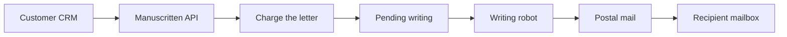
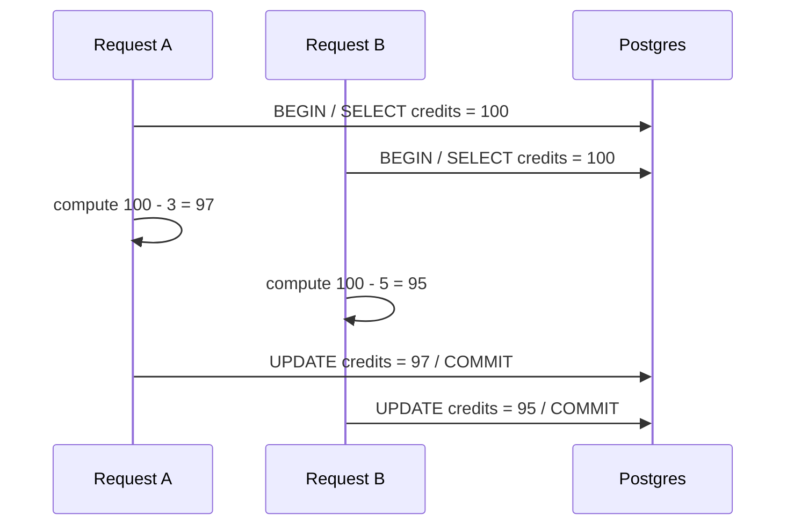

# The Day Concurrency Broke the Billing of My App

About a week before everything broke, we had launched the Manuscritten API.

That API was supposed to remove a very annoying step from our customers' workflow.

Until then, many customers had to upload CSVs when they wanted to create a batch of handwritten letters. The API would let them do it directly from their own applications: CRM workflows, ecommerce automations, internal tools, whatever already had the customer data.

That was the promise: connect Manuscritten once, then send handwritten letters from the tools they were already using.

Then one of our best customers used it for real.

The API looked fine.

The letters were there. The addresses were there. There were no obvious errors in the admin panel.

Only one thing was wrong: the credits barely moved.

We had received around 1,000 letter creation requests. But the company balance looked as if we had charged only around 100 of them.

If each letter costs roughly $3, this was not a rounding error. It was the difference between about $3,000 of work and about $300 charged. Around $2,700 had effectively disappeared from the billing state.

Nothing had exploded. That was the dangerous part. Every individual request could succeed while the final accounting state was wrong.

It did not take long to realize what had happened: our credits system had a race condition.

In this series, I want to unpack four things:

- the exact mechanism that broke the credits system, and how to recognize designs that are vulnerable to the same bug;
- why these problems are hard to find during normal development, and why unit tests and regular integration tests rarely help;
- how to build load tests that measure the specific accounting invariant you care about;
- and finally, the Postgres strategies we considered to fix it, including the one we chose.

But before getting into the race condition itself, I need to give you a bit of context.

## What Manuscritten Does

Manuscritten sends handwritten letters for companies.

And yes, I mean real letters. Physical letters. Written by hand, although in our case the hand belongs to a robot. They are the kind of thing a company sends when it wants to leave a warmer impression than another email notification or another automated WhatsApp.

Customers use them for prospecting, reactivation, thank-you notes, loyalty campaigns, and follow-ups after a customer signs up, purchases, or reaches some milestone in a CRM.

Our mission is to make sending those handwritten letters as easy as possible.

That means we cannot ask customers to change how their business already works. If their customer data lives in a CRM, an ecommerce platform, or an internal tool, Manuscritten has to connect to those tools. The API was the piece that made that possible.

Once the connection existed, customers could start sending real handwritten letters to their customers' mailboxes without moving a finger. Or picking up a pen.

Imagine an ecommerce company has just launched a new product. They want to send a handwritten letter to customers who have already bought from them three times, because those customers are good candidates for an upsell.

They set up an automation in their CRM:

```text
When a customer's purchase count reaches 3,
send that customer's name and address to the Manuscritten API.
```

From the customer's point of view, this is simple. Their CRM detects a business event and calls our API.

From our point of view, the flow is:

1. Receive the letter request.
2. Create the letter.
3. Calculate the price.
4. Charge the company credits.
5. Mark the letter as pending writing.
6. Later, when there is available writing capacity, send the job to the writing robot.
7. Finally, send the handwritten letter through postal mail.

The simplified flow looks like this:



This matters because the API turned letter creation from a manual batch operation into something software could trigger automatically.

A historical sync can send many letters.

A CRM workflow can send many letters.

An ecommerce automation can make many customers eligible at the same time.

So concurrency was not an exotic edge case. It was a normal consequence of the product working as intended.

For this article, the interesting part is one box in that diagram: **Charge the letter**.

That is where the race condition lived.

## How Billing Works

The number of letters that can arrive through the API is variable.

One day a customer sends two letters. Another day a customer syncs a historical segment and sends 1,000 in a second.

That variability matters because every physical letter has a real cost: paper, ink, envelope, postage, operations, writing capacity. We need a billing model that is flexible enough for customers and still protects the business when volume spikes.

The model we use is prepaid credits.

A customer buys credits in advance. Then, every time a new letter arrives through the API, we calculate its cost and subtract it from the company's available credits.

The price of a letter can depend on things like destination country, paper quality, and other production details. But the simplified model is intentionally small:

Each company has a credit balance. Each letter has a price. When a letter arrives, we calculate the cost and charge it against the company's credits.

The simplified model looks like this:

```ts
class Company {
  id: string;
  availableCredits: number;
}

class Letter {
  id: string;
  companyId: string;
  address: string;
  country: string;
  price: number;
}
```

`availableCredits` represents prepaid credits the company can spend.

For this first article, the important case is the happy path: a letter arrives, the company has enough credits, and we subtract the letter price from `availableCredits`.

The invariant is straightforward:

```text
finalAvailableCredits = initialAvailableCredits - totalChargedLetterCost
```

If a company starts with 100 credits and we successfully charge letters worth 8 credits, the company should end with 92 credits.

That sounds almost too obvious to write down.

But when a system has money-like state, the obvious invariant is exactly the thing worth protecting.

So what happened when a letter arrived through the API?

The real endpoint had validation, campaign checks, design lookups, address validation, analytics, and side effects. None of that is the interesting part of the bug.

The accounting shape was the interesting part.

Simplified, the code did something like this:

```ts
await db.transaction(async (tx) => {
  const company = await companyRepo.find(tx, campaign.companyId);

  const letter = Letter.new({
    companyId: campaign.companyId,
    recipientName: input.name,
    address: input.address,
    country: input.country,
  });

  const cost = letter.getCreditCost();
  const available = company.getAvailableCredits();

  company.setAvailableCredits(available - cost);
  letter.markAsCharged();

  await letterRepo.saveLetter(tx, letter);
  await companyRepo.saveCompany(tx, company);
});
```

This does a read-modify-write:

1. Read the current value.
2. Compute a new value in application memory.
3. Write the computed value back later.

In SQL terms, the whole transaction has this shape:

```sql
BEGIN;

SELECT available_credits
FROM company
WHERE id = $company_id;

-- The application computes:
-- computed_available_credits = available_credits - letter_price

INSERT INTO letter (
  id,
  company_id,
  recipient_name,
  address,
  country,
  price
) VALUES (
  $letter_id,
  $company_id,
  $recipient_name,
  $address,
  $country,
  $letter_price
);

UPDATE company
SET available_credits = $computed_available_credits
WHERE id = $company_id;

COMMIT;
```

Do you spot where the race condition is here?

## Where The Race Condition Lives

Imagine the company starts with 100 credits.

Two letters arrive at almost the same time:

- John's letter costs 3 credits.
- Tracy's letter costs 5 credits.

The correct final balance is:

```text
100 - 3 - 5 = 92
```

The dangerous detail is that the final `UPDATE` does not say "subtract this letter price from the current balance."

It says "store this balance I computed earlier."

That distinction is the whole bug.

Now imagine the two requests overlap like this:

```text
Initial state:
company.availableCredits = 100

Request A, John's letter:
1. Begins transaction
2. Reads company.availableCredits = 100
3. Letter costs 3
4. Computes new balance = 97

Request B, Tracy's letter:
5. Begins transaction
6. Reads company.availableCredits = 100
7. Letter costs 5
8. Computes new balance = 95

Request A:
9. Saves company.availableCredits = 97
10. Commits

Request B:
11. Saves company.availableCredits = 95
12. Commits

Final state:
company.availableCredits = 95
```

Both letters exist.

Both requests succeeded.

But the company was charged only 5 credits. John's 3 credits disappeared from the accounting result.

If the writes happen in the opposite order, the final balance is 97 and Tracy's 5 credits disappear instead.

The database did exactly what we asked it to do.

That was the uncomfortable part.

Postgres did not randomly lose credits. It stored the values the application sent. The bug was that both values had been computed from the same stale balance.

## But There Was A Transaction

This is the natural objection.

And it is the one that makes this kind of bug easy to miss during development.

The code used a transaction. The letter, campaign, and company were saved together. The request did not leave the system half-written.

But that was not the problem.

A transaction can make a set of operations atomic for one request. It does not automatically make a read-modify-write sequence safe when another transaction is reading and writing the same balance at the same time.

In fact, because of MVCC and transaction isolation, this is exactly the kind of thing a database is designed to allow. One transaction does not normally see another transaction's uncommitted changes. So unless we explicitly tell the database to coordinate access to that company balance, each request can work from its own snapshot and have zero knowledge that another request is touching the same row.

That is how a transaction can still make a correct local decision from stale global state.

Two transactions can both read:

```text
available_credits = 100
```

Then both can compute different new absolute values:

```text
Request A: 100 - 3 = 97
Request B: 100 - 5 = 95
```

And both can later write their own result:

```text
Request A writes 97
Request B writes 95
```

The last writer wins.

One subtraction disappears.

Here is the same interleaving as a sequence:



The bug was not that we forgot to use a transaction.

The bug was that the transaction persisted a decision made from a value that was no longer current by the time we wrote it back.

## Why This Was Hard To Notice

The worst part of this bug was that the individual records looked fine.

If you opened the admin panel, the letters were there.

If you inspected the addresses, they were there.

If you looked for request failures, there was nothing obvious.

That is why this class of bug is so dangerous. It does not necessarily break the thing you are staring at.

The failure was not in the existence of a letter.

It was in the sum of all successful letters.

Normal tests rarely catch that.

A unit test that calls the billing method once will pass.

An integration test that creates one letter through the API will pass.

Even an integration test that creates ten letters sequentially can pass, because each request sees the latest balance before computing the next one.

The bug only appears when multiple successful operations overlap in time and mutate the same accounting state.

That is exactly what real customers do once you give them an API.

## How Can We Reproduce The Bug Then?

This is where unit tests and regular integration tests stop being enough.

Concurrency bugs are difficult because they are uncertain. Sometimes the requests overlap in exactly the wrong way. Sometimes they do not. Sometimes the bug appears immediately. Sometimes you run the same flow again and everything looks fine.

That is not good enough for a billing system.

If we want to know that the system works as intended, we need a test that reproduces the kind of stress under which this bug appears. Otherwise we cannot know whether a solution really fixed the issue, or whether we simply failed to trigger it that time.

So the first step was not to choose the cleverest database fix.

The first step was to build a test that could simulate concurrent API traffic and reproduce the bug we had seen in production.

Only after that could we compare possible solutions and see whether they actually protected the numbers.

In the next post, I will show how we built that test with k6, and how to check that the accounting stays correct even when the API receives thousands of requests.
