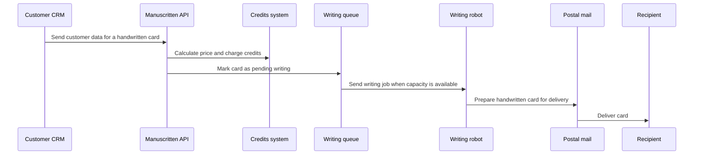
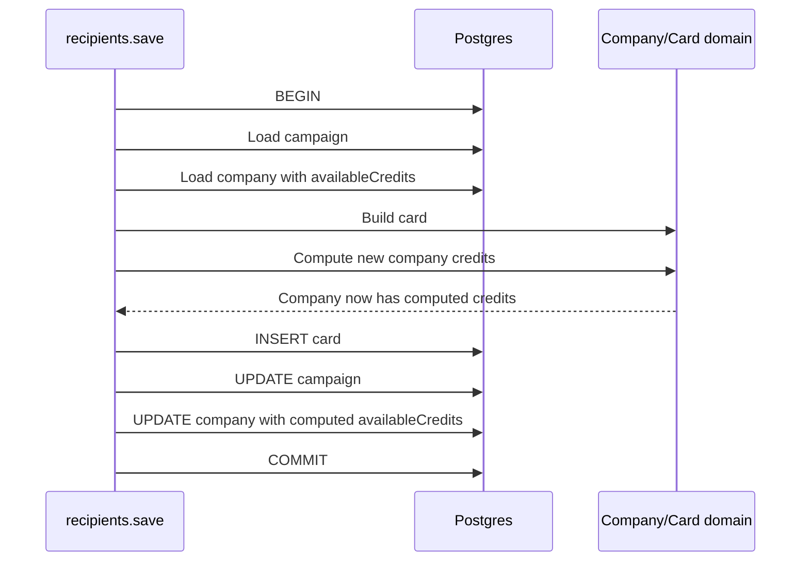
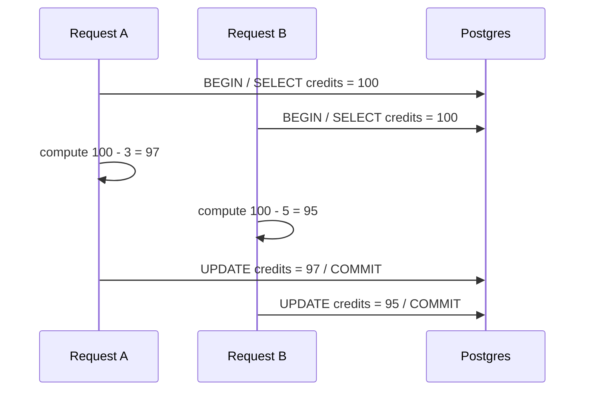
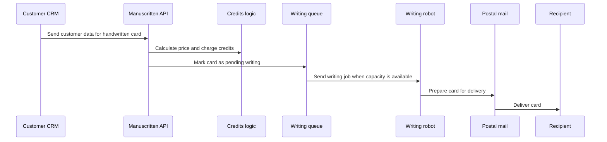
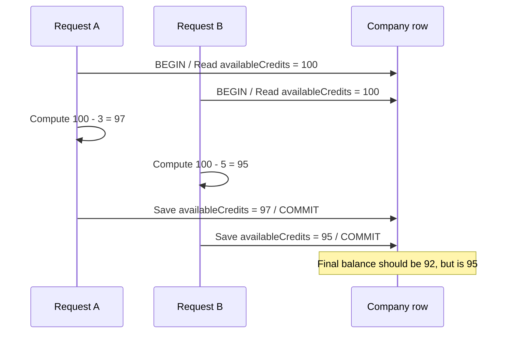

# Draft: The Day Concurrency Broke the Billing of My App

## Article Role In The Series

This is post 1 of the series. Its job is to make the bug understandable.

It should not explain the k6 test harness in detail, and it should not compare all possible Postgres fixes. It should end with the need to reproduce the race condition properly, which leads into post 2.

## Working Title

The Day Concurrency Broke the Billing of My App

Alternative title if the final article needs to sound more technical:

The Race Condition Hidden Inside a Successful API Call

## Core Thesis

The system did not fail because the API crashed, rejected requests, or lost cards.

It failed because successful concurrent requests made billing decisions from stale credit balances, then saved those decisions back as absolute values.

The important sentence to preserve:

> The bug was not that we forgot to use a transaction. The bug was that the transaction persisted a decision made from a value that was no longer current by the time we wrote it back.

## Reader Promise

By the end of the article, the reader should understand:

- how Manuscritten's credit system works at a simplified level;
- why the card creation endpoint was vulnerable;
- what a read-modify-write race condition looks like in a real billing path;
- why a successful API response does not imply correct accounting;
- why this kind of bug is hard to catch with normal unit/integration tests.

## Section 1: Hook / Introduction

### Goal

Open in the middle of the incident. Make the reader feel the billing mismatch before explaining the system.

### Notes From Schema

- Manuscritten had recently launched its API.
- Customers wanted to create handwritten cards directly from their own applications instead of uploading CSVs manually.
- This matters narratively: the API was built exactly for this kind of use case. Customers should be able to trigger cards from their own CRMs, ecommerce platforms, and automations without a manual import step.
- A major customer used the API to send a large historical batch, roughly 1,000 card creation requests.
- Frame this as the customer using the product as intended, not abusing the endpoint.
- The system appeared healthy:
  - no visible errors;
  - cards were created;
  - addresses looked correct;
  - the admin panel showed the new records.
- But billing did not add up.
- We had received around 1,000 cards, but the credits looked as if only around 100 had been charged.
- Use money to make the mismatch concrete:
  - if each card costs about $3, then 1,000 cards should be about $3,000;
  - charging only 100 cards would be about $300;
  - the mismatch is about $2,700.
- The discovery: the credits system had a race condition.

### Draft Shape

Start with something like:

```text
About a week after launching the Manuscritten API, one of our best customers sent a large batch through it.

That was the whole point of the API.

Until then, many customers had to upload CSVs when they wanted to create a batch of handwritten cards. The API was supposed to let them do it directly from their own applications: CRM workflows, ecommerce automations, internal tools, whatever already had the customer data.

The API looked fine.

The cards were there. The addresses were there. There were no obvious errors in the admin panel.

Only one thing was wrong: the credits barely moved.
```

Then sharpen the mismatch with real numbers:

```text
We had received around 1,000 card creation requests. But the company balance looked as if we had charged only around 100 of them.

If each card costs roughly $3, this was not a rounding error. It was the difference between about $3,000 of work and about $300 charged. Around $2,700 had effectively disappeared from the billing state.
```

### Series Loop Before Context

At the end of the hook, explicitly tell the reader what the series will cover. This is important because the next section slows down into product context; the open loop keeps the reader oriented.

Use this shape:

```text
In this series, I want to unpack four things:

- the exact mechanism that broke the credits system, and how to recognize designs that are vulnerable to the same bug;
- why these problems are hard to find during normal development, and why unit tests and regular integration tests rarely help;
- how to build load tests that measure the specific accounting invariant you care about;
- and finally, the Postgres strategies we considered to fix it, including the one we chose.

But before getting into the race condition itself, I need to give you a bit of context.
```

### Transition

Use this sentence or a variant before the series loop:

```text
Nothing had exploded. That was the dangerous part. Every individual request could succeed while the final accounting state was wrong.
```

## Section 2: What Manuscritten Does

### Goal

Give just enough product context for the billing bug to make sense, and make the API use case vivid enough that concurrent card creation feels natural.

### Content

Manuscritten sends handwritten letters for companies. Customers use it for:

- prospecting;
- reactivation;
- thank-you or loyalty messages;
- follow-ups after a customer signs up, purchases, or reaches a CRM milestone.

### Concrete Example

Use a concrete ecommerce/CRM example before explaining billing internals.

Example:

```text
Imagine an ecommerce company has just launched a new product. They want to send a handwritten card to customers who have already bought from them three times, because those customers are good candidates for an upsell.

They set up an automation in their CRM:

when a customer's purchase count reaches 3, take that customer's name and address and send it to the Manuscritten API.
```

The flow is then:

- a CRM automation detects a contact event;
- the customer's system calls Manuscritten's API;
- Manuscritten receives the card request and creates the card;
- Manuscritten calculates the price and charges the card against the company's credits;
- the card is marked as pending writing;
- later, when there is available writing capacity, Manuscritten sends the job to the writing robot;
- finally, the handwritten card is sent to the recipient through postal mail.

### Diagram

Use this sequence diagram to make the API use case concrete:



### Why This Matters For The Bug

The API turned card creation from a manual batch operation into something that could happen from software events:

- a historical sync;
- a CRM workflow;
- an ecommerce automation;
- a batch of contacts becoming eligible at the same time.

That means many cards can arrive close together. Concurrency is not an exotic edge case here; it is a normal consequence of the product working as intended.

### Keep It Short

This is context, not the article's main point. The open loop in section 1 should make this context feel earned, not like a detour.

## Section 3: The Simplified Billing Model

### Goal

Introduce the minimal domain model.

### Concepts

- A `Company` owns the credit balance.
- `Company.availableCredits` stores prepaid credits that can be spent.
- `Company.dueCredits` stores credits owed when the system accepts work that cannot be covered by available credits.
- A `Card` has a price.
- When a card arrives through the API, the system calculates the card cost and updates the company's credit state.

### Minimal Pseudocode

Use a simplified model before showing the endpoint:

```ts
class Company {
  id: string;
  availableCredits: number;
  dueCredits: number;
}

class Card {
  id: string;
  companyId: string;
  price: number;
}
```

Then describe the intended invariant:

```text
If a company starts with 100 credits and we successfully charge cards worth 8 credits, the company should end with 92 credits.
```

Use this invariant explicitly:

```text
finalAvailableCredits = initialAvailableCredits - totalChargedCardCost
```

## Section 4: The Card Creation Flow And The In-Memory Billing Decision

### Goal

Show the vulnerable path and inline the billing decision inside the endpoint so the reader can see the whole read-modify-write shape in one place.

### Real Code Anchor

The important method is:

```text
apps/web/src/server/api/card/recipients.ts
```

Specifically, the `save` mutation.

The real code had validation, campaign checks, design lookups, address validation, and side effects around this flow. For the article, simplify it into the accounting shape that matters.

### Narrative Pseudocode

For coherence in the article, present the flow as if the read and write both happen inside the same transaction. This keeps the example focused on the real bug: a read-modify-write operation that saves an absolute computed value.

Note for accuracy: in the original code, some of the state loading happened before the transaction, which made the race easier to trigger. The simplified version below is still vulnerable and easier to explain.

```ts
await db.transaction(async (tx) => {
  const campaign = await campaignRepo.find(tx, input.campaignId);
  const company = await companyRepo.find(tx, campaign.companyId);

  const card = Card.new({
    input,
    companyId: campaign.companyId,
    cardDesign,
    envelopeDesign,
    validated: true,
  });

  const cost = card.getCreditCost();
  const available = company.getAvailableCredits();

  if (available >= cost) {
    company.setAvailableCredits(available - cost);
    campaign.assignCredits(cost);
    card.markAsCharged();
  } else {
    company.setDueCredits(company.getDueCredits() + cost);
    campaign.addDueCredits(cost);
    card.markAsOwed();
  }

  await cardRepo.saveCard(tx, card);
  await campaignRepo.save(tx, campaign);
  await companyRepo.saveCompany(tx, company);
});
```

### Explain In Plain English

The request did roughly this:

1. Start a transaction.
2. Load the campaign.
3. Load the company and its current credits.
4. Build the card.
5. Read `availableCredits`.
6. Compute the new credit balance in application memory.
7. Save the card.
8. Save the campaign.
9. Save the company with the newly computed absolute credit balance.

### Diagram

Use this Mermaid sequence diagram in the draft or final article:



### Key Framing

The dangerous detail is not that the system writes to the company table. It is that it writes a value computed earlier from a snapshot:

```sql
UPDATE company
SET available_credits = $computed_available_credits
WHERE id = $company_id;
```

That value might no longer be current by the time the update runs.

This is the read-modify-write pattern:

1. Read the current value.
2. Compute a new value in application memory.
3. Write the computed value back later.

This is safe only if nobody else can change the value between steps 1 and 3, or if the database is forced to detect/prevent that conflict.

## Section 5: Where The Race Condition Lives

### Goal

Explain the race condition with a concrete interleaving. This is the heart of the article.

### Example

Use two cards:

- John's card costs 3 credits.
- Tracy's card costs 5 credits.
- The company starts with 100 credits.

Correct final balance:

```text
100 - 3 - 5 = 92
```

Race-condition result:

```text
95 or 97, depending on which request writes last
```

### Step-By-Step Dance

```text
Initial state:
company.availableCredits = 100

Request A, John's card:
1. Begins transaction
2. Reads company.availableCredits = 100
3. Card costs 3
4. Computes new balance = 97

Request B, Tracy's card:
5. Begins transaction
6. Reads company.availableCredits = 100
7. Card costs 5
8. Computes new balance = 95

Request A:
9. Saves company.availableCredits = 97
10. Commits

Request B:
11. Saves company.availableCredits = 95
12. Commits

Final state:
company.availableCredits = 95
```

The system created both cards, but the company was charged only 5 credits. John's 3 credits disappeared from the accounting result.

If the writes happen in the opposite order, the final balance is 97 and Tracy's 5 credits disappear instead.

### Equivalent SQL Shape

```sql
-- Request A
BEGIN;

SELECT available_credits
FROM company
WHERE id = $company_id;
-- returns 100

-- Request B
BEGIN;

SELECT available_credits
FROM company
WHERE id = $company_id;
-- returns 100

-- Request A writes its computed value
UPDATE company
SET available_credits = 97
WHERE id = $company_id;

COMMIT;

-- Request B writes its computed value
UPDATE company
SET available_credits = 95
WHERE id = $company_id;

COMMIT;
```

The database did exactly what it was asked to do. The application asked it to store stale computed values.

## Section 6: Why The Transaction Did Not Save Us

### Goal

Address the natural objection: "But there was a transaction."

### Explanation

The simplified flow above uses a transaction, and it is still vulnerable.

The reason is that a regular transaction groups the operations in one request. It does not automatically serialize every other request that reads and writes the same row.

Two transactions can both read `available_credits = 100`, both compute a different new absolute value, and both later write their own computed result. The last writer wins, and one subtraction disappears.

### Key Paragraph To Preserve

```text
A transaction can make a set of operations atomic for one request. It does not automatically make a read-modify-write sequence safe when another transaction can read the same starting value and later overwrite the result.
```

### Optional Small Diagram



## Section 7: Why This Was Hard To Notice

### Goal

Explain why normal development signals did not catch the problem.

### Points

- Each request can be valid in isolation.
- Each response can be successful.
- The database can contain all created cards.
- No exception has to be thrown.
- The bug appears only in aggregate state after concurrent operations.
- Unit tests that call the endpoint once will not expose it.
- Integration tests that create cards sequentially will not expose it.
- Admin-panel inspection can look healthy if the reviewer checks cards and addresses but not credit invariants.

### Phrase To Use

```text
The failure was not in the existence of a card. It was in the sum of all successful cards.
```

## Section 8: The Invariant We Should Have Been Testing

### Goal

Set up post 2.

### Invariant

For a batch of card creations:

```text
credits_after = credits_before - total_price_of_charged_cards
```

If some cards become owed instead of charged, then the invariant needs to include due credits:

```text
available_after + due_delta = available_before - charged_delta
```

Keep the post 1 version simple. The detailed testing logic belongs in post 2.

### Transition To Post 2

End with the realization that the next step was not immediately choosing a fix. The next step was to make the bug reproducible.

Possible closing:

```text
At that point, we did not need a clever fix yet. We needed proof.

If this was really a race condition, we should be able to make it happen on demand: start with a known balance, create a known number of cards concurrently, and check whether the final credits matched the total cost of those cards.

That became the next problem: building a test that could make concurrency fail loudly instead of occasionally corrupting billing quietly.
```

## Snippets To Include

### Vulnerable Endpoint Shape

Use this short version in final prose:

```ts
await db.transaction(async (tx) => {
  const company = await companyRepo.find(tx, campaign.companyId);
  const card = Card.new({ input, companyId: campaign.companyId, ...designs });

  const cost = card.getCreditCost();
  const available = company.getAvailableCredits();
  company.setAvailableCredits(available - cost);
  card.markAsCharged();

  await cardRepo.saveCard(tx, card);
  await companyRepo.saveCompany(tx, company);
});
```

### Dangerous Persistence Shape

```sql
UPDATE company
SET available_credits = $computed_available_credits
WHERE id = $company_id;
```

### Read-Modify-Write Core

```ts
const cost = card.getCreditCost();
const available = company.getAvailableCredits();

company.setAvailableCredits(available - cost);
card.markAsCharged();
```

## Diagrams To Include

### Manuscritten API Flow

Use the more specific ecommerce/CRM flow from Section 2 unless the final article needs a shorter diagram.



### Race Condition Interleaving



## Things To Avoid In This Post

- Do not explain the final atomic update solution yet.
- Do not compare row-level locks, advisory locks, serializable transactions, and single-worker processing yet.
- Do not spend much time on Graphile jobs or side effects.
- Do not make the article about k6; only set up why k6 became necessary.
- Do not overfit the examples to every campaign type. Use the simplified automated-card path.

## Open Questions Before Final Prose

- Should the final article say "about $2,700 missing from billing state" or round it narratively as "almost $3,000"?
- Should John/Tracy remain as the race-condition names, or should the final article use Request A / Request B throughout?
- Should the title stay personal and narrative, or should it be changed to the more technical alternative?
