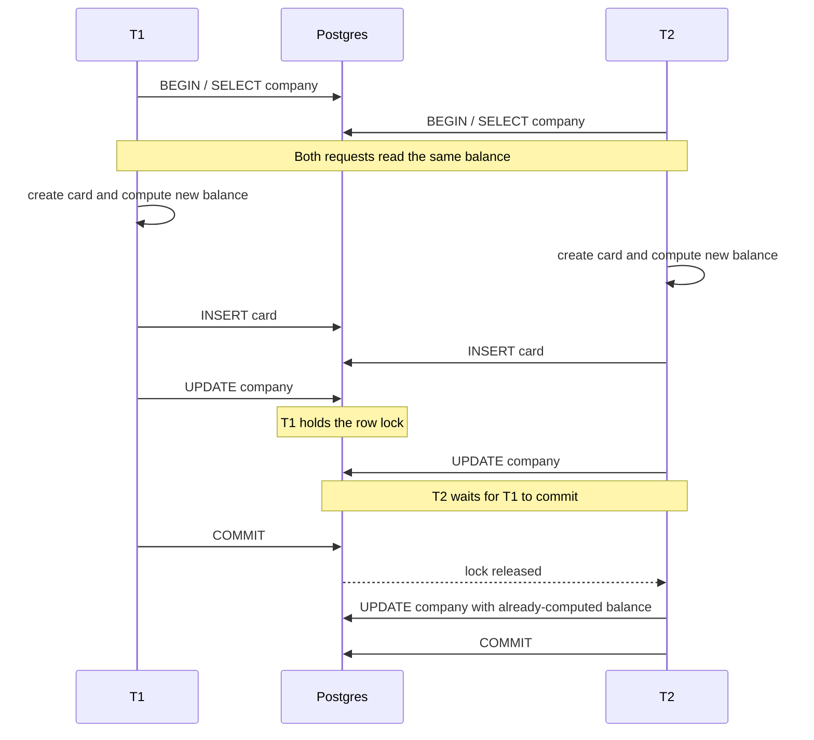
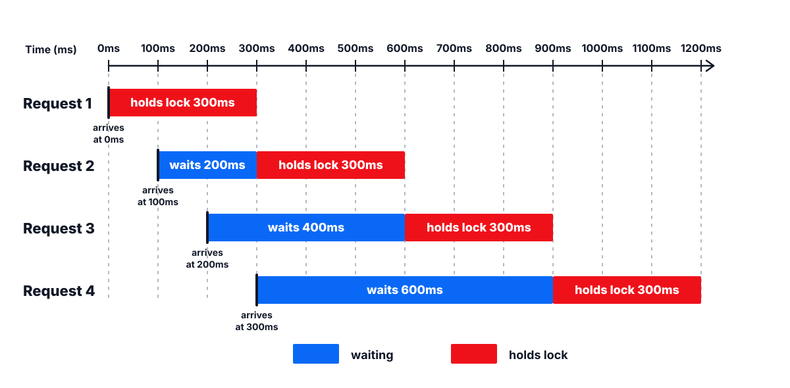

# How do you choose a concurrency strategy for a credits system (without becoming a database expert)?

In the first article, we saw how a race condition appeared inside our payment system. Two perfectly successful card-creation requests could happen at the same time, both return OK, and still leave the company’s credit balance wrong.

In the second article, we made the bug reproducible. We built a k6 test that simulated concurrent card creation, hammered the endpoint, and proved that the accounting state could drift under load.

This article is about different ways we could solve that problem specifically in Postgres.

That is different from the previous two articles. Those were mostly about the bug itself: how it appeared, why the code looked reasonable, and how we reproduced it. This one is more database-specific on purpose. Why? Because we use Postgres, and because concurrency control is one of those topics where a generic answer often becomes too vague to help anyone. The useful question is not “how do databases solve races?” It is “given this endpoint and this database, what tools do we actually have?”

We will look at four Postgres options:

1) Row-level locks.
2) Advisory locks.
3) Atomic updates.
4) Serializable transactions.

But before comparing them, let’s take a step back and think about the shape of the problem.

Our endpoint works fine when there is only one card-creation request for a company. It fails when multiple requests for the same company overlap. We saw why in the first article: each request reads the same balance, computes a new balance in application memory, and later writes that computed value back.

So if we want to fix the race condition, we need the endpoint to behave as if there were only one request for that company at the critical moment, even when there are many. We need to isolate each request from the others while it makes the credit decision.

Thankfully, Postgres gives us several tools to deal with isolation.

## Postgres is already using locks

Postgres works in transactions. When you explicitly write `BEGIN` and `COMMIT`, you create a transaction yourself. When you run a single SQL statement without an explicit transaction, Postgres still runs that statement inside an implicit transaction.

That matters because locks live inside transactions.

Postgres is built to handle many concurrent transactions at the same time, so it needs mechanisms to prevent two transactions from corrupting the same data. One of those mechanisms is locking.

Every SQL statement acquires some kind of lock. The exact lock depends on the statement and the object being touched.

A plain `SELECT` takes a table-level `ACCESS SHARE` lock. That prevents disruptive schema changes while the query runs, but it does not block normal writes. So you can make a SELECT that returns a row and an UPDATE that touches that same row at the **same time** without postgres blocking that.

A normal `UPDATE` that does not modify key columns takes two relevant locks:

- a table-level `RowExclusiveLock`, and
- a row-level `FOR NO KEY UPDATE` lock on each row it updates.

The row-level lock is the part that matters for our bug. What it enforces is that if two transactions try to update the same row at the same time, the second one has to wait. If they update different rows, they can proceed concurrently.

For our endpoint, the interesting conflict is not at the table level. The concurrency happens when two requests try to create cards for the same company row. That means row-level locks are the important part.

A plain SELECT and an UPDATE can overlap on the same row:

```sql
-- Transaction 1
BEGIN;
SELECT available_credits
FROM company
WHERE id = 'company_123';

-- Transaction 2 can still update the same row
UPDATE company
SET available_credits = available_credits - 7
WHERE id = 'company_123';
COMMIT;
```

Two updates to different rows can also overlap:

```sql
-- Transaction 1
BEGIN;
UPDATE company
SET available_credits = available_credits - 7
WHERE id = 'company_123';

-- Transaction 2 can update another company row at the same time
UPDATE company
SET available_credits = available_credits - 7
WHERE id = 'company_456';
COMMIT;
```

But two updates to the same row cannot modify it at the same time:

```sql
-- Transaction 1
BEGIN;
UPDATE company
SET available_credits = available_credits - 7
WHERE id = 'company_123';

-- Transaction 2
BEGIN;
UPDATE company
SET available_credits = available_credits - 7
WHERE id = 'company_123';
-- waits until Transaction 1 commits or rolls back
```

In that last example, the second `UPDATE` conflicts with the first transaction's row-level `FOR NO KEY UPDATE` lock on `company_123`.

Once a transaction acquires a row lock, it keeps that lock until the transaction ends. If a transaction updates the company row and then does five more operations before committing, the row lock is not released after the update statement finishes. It is released after the transaction commits or rolls back.

That can feel annoying when you are staring at a blocked request, but it is central to how Postgres preserves consistency. Under MVCC, other transactions can keep reading older committed versions of rows while a transaction is in progress. The row lock protects the uncommitted write until Postgres knows whether that new version becomes real at commit time or disappears at rollback time.

## Locking is already working in our code

This behavior, of course, applies to our endpoint.

The read-modify-write flow, if you do not remember it, was this:

```ts
await ctx.db.transaction(async (tx) => {
  const company = await companyRepo.find(tx, companyId);
  if (!company) throw new Error("Company not found");

  const card = Card.new({
    companyId,
    recipientName: input.name,
    address: input.address,
    country: input.country,
  });

  const cost = card.getCreditCost();
  const available = company.getAvailableCredits();

  company.setAvailableCredits(available - cost);
  card.markAsCharged();

  await cardRepo.saveCard(tx, card);
  await companyRepo.saveCompany(tx, company);
});
```

And in SQL terms:

```sql
BEGIN;

SELECT available_credits
FROM company
WHERE id = $company_id;

-- The application computes:
-- computed_available_credits = available_credits - card_price

INSERT INTO card (
  id,
  company_id,
  recipient_name,
  address,
  country,
  price
) VALUES (
  $card_id,
  $company_id,
  $recipient_name,
  $address,
  $country,
  $card_price
);

UPDATE company
SET available_credits = $computed_available_credits
WHERE id = $company_id;

COMMIT;
```

Now imagine two transactions, `T1` and `T2`, arrive at almost the same time for the same company.

Both can run the initial `SELECT` and read the same balance, because a plain select does not lock the row against updates. Both can create their card object. Both can compute what they want the company balance to become.

Then they reach the `UPDATE`.

If `T1` gets there first, Postgres lets it update the company row and gives it the row lock. When `T2` reaches its own `UPDATE`, Postgres sees that the row is already locked by `T1`, so `T2` waits.



This was the second issue we found at the end of the previous post. The inconsistent balance was not the only thing caused by concurrency. We also found that the time to serve a request exploded under load.

When I tried to identify what was causing that second issue, I found that many requests were blocked at the database.

<!-- TODO: Insert the dashboard screenshot showing many blocked requests once the final capture is available. -->

The waiting time was accumulating across requests.

Imagine one company is having a busy moment and creates 10 cards per second, one every 100ms. Now suppose the work from the moment a transaction acquires the company row lock until it commits takes 300ms per request. Because only one request can hold the company row lock at a time, we can only process one of those locked sections every 300ms.

The first request arrives at 0s and starts immediately (no wait time). The second arrives at 0.1s, but the lock is still held, so it waits about 200ms until the first one finishes. Suddenly that second request takes around 500ms instead of 300ms.

The third request arrives at 0.2s. It waits about 100ms for the first request to finish, then a full 300ms for the second request to run. Its total time is now roughly 700ms.



In general, each new request adds about 200ms of backlog, because 300ms of locked work arrives every 100ms. After 10 seconds, 100 requests have been received. At that point, the queue has been accumulating for about 99 * 200ms = 19.8s. So the 100 request will have to wait almost 20 seconds before it can be processed, and then spends its own 300ms doing work. And the block time will keep increasing while the card receiving rate is preserved.

This is how waiting becomes an outage. Tail latency climbs, clients time out, retries add load, and the queue feeds itself.

```sql
SELECT
  blocked.pid  AS blocked_pid,
  blocked.query AS blocked_query,
  blocking.pid AS blocking_pid,
  blocking.query AS blocking_query
FROM pg_stat_activity blocked
JOIN LATERAL unnest(pg_blocking_pids(blocked.pid)) AS blocking_pid(pid) ON true
JOIN pg_stat_activity blocking ON blocking.pid = blocking_pid.pid
ORDER BY blocked.pid;
```

Hypothetical output when three concurrent card creates hit the same company:

| blocked_pid | blocked_query                                    | blocking_pid | blocking_query |
|------------|---------------------------------------------------|--------------|----------------|
| 7002       | UPDATE "company" SET available_credits = $1 ...   | 7001         | COMMIT         |
| 7003       | UPDATE "company" SET available_credits = $1 ...   | 7001         | COMMIT         |

`blocked_pid` is the session that is waiting. `blocking_pid` is the one currently holding the lock. In this example, PIDs 7002 and 7003 are waiting to update the company row while 7001 is the transaction in front of the line.

By default, a blocked query can wait indefinitely. In a real product, you usually want upper bounds:

- `lock_timeout`: how long a statement is allowed to wait to acquire a lock before Postgres errors.
- `statement_timeout`: how long a statement is allowed to run in total.
- `log_lock_waits`: whether Postgres logs lock waits that exceed a threshold.

You can set these globally, per role, per database, or inside a transaction with `SET LOCAL`. For user-facing APIs, I usually want a bounded wait rather than a request that can silently hang forever.

## If locking is already working, why is our code failing?

One could ask: concurrency issues are solved by locking, right? If Postgres is already locking the company row during the update, why do we still have a race condition?

Because we are locking too late.

By the time our transaction reaches the UPDATE, the application has already read the old balance, created the card, and computed the value it wants to write. While the second transaction is waiting for the row lock, the first transaction can commit a new balance. But the second transaction does not automatically recompute its decision after the wait. It just writes the value it computed earlier.

The lock protects the physical update from happening at the exact same instant. It does not protect the earlier decision that produced the stale value.

So the first way to solve the issue is conceptually simple: move the lock before the read.

That is row-level locking. But before we zoom into it, it is worth naming the tradeoff space.

## The shape of the options

All four Postgres solutions are trying to answer the same question: what should happen when two requests want to change the same company balance at the same time?

They do not all answer it the same way.

Row-level locks say: one request goes first, and the other waits. The tradeoff is simple correctness at the cost of queueing under contention.

Advisory locks say almost the same thing, but with a mutex key we choose instead of a physical row. The tradeoff is flexibility at the cost of discipline: every code path has to remember to take the same logical lock.

Atomic updates say: let Postgres do the read-modify-write in one statement. The request may still wait on the row, but the locked section is much smaller because the decision and the update happen inside the database.

Serializable transactions say: let requests run, and if Postgres detects that the result would not be equivalent to a clean serial order, abort one transaction. The tradeoff is that correctness comes with retries.

So the options are not just different implementations. They are different failure modes:

- Row-level locks and advisory locks mostly fail by waiting.
- Atomic updates still wait, but try to make the wait tiny.
- Serializable transactions fail by aborting and making you retry.

Let’s now go with the first one.

## Option 1: Row-level locks (`SELECT … FOR UPDATE`)

Row-level locking is the simplest contract: before you change a company’s credits (because a card is being created or deleted), you make sure you’re the only request allowed to touch that company’s balance for a moment.

In Postgres, the most direct way to do that is to lock the company row, do the credits work, then commit. If two card creations hit the same company at the same time, one proceeds and the other waits. Concurrency becomes a queue per company.

### The mechanism (lock first, then charge, then persist)

With row level lock in place the endpoint basically looks the same as it did before except that now we move the lock to the SELECT:

1) Start a transaction.  
2) Lock the company row (`SELECT … FOR UPDATE`).  
3) Compute the new balance from the *current* balance.
4) Persist both the card and the updated company balance.

Here’s the shape in code:

```ts
async function saveCardAndChargeCredits() {
  await ctx.db.transaction(async (tx) => {
    const company = await companyRepo.findForUpdate(tx, companyId);
    if (!company) throw new Error("Company not found");

    const card = Card.new({
      companyId,
      recipientName: input.name,
      address: input.address,
      country: input.country,
    });

    const cost = card.getCreditCost();
    const available = company.getAvailableCredits();

    company.setAvailableCredits(available - cost);
    card.markAsCharged();

    await cardRepo.saveCard(tx, card);
    await companyRepo.saveCompany(tx, company);
  });
}
```

```ts
async findForUpdate(tx: DbTransaction, id: string) {
  const rows = await tx.execute(sql`
    SELECT id
    FROM "company"
    WHERE id = ${id}
    FOR UPDATE
  `);
  if (!rows.length) return null;

  const result = await tx.query.companies.findFirst({
    where: eq(companies.id, id),
  });

  if (!result) return null;
  return parseCompany(result);
}
```

Two details matter here:

- The lock has to be taken **inside the same transaction** that charges credits and writes the result. Otherwise you’re not protecting the critical section.
- Your repository needs to run on the transaction connection in the ORM (`tx` in this case). Otherwise you can “lock” in one connection and “save” in another, which is like putting a “Reserved” sign on a table… in a different restaurant.

### The concurrency “dance” (what actually happens)

To see how this works internally, assume two card creations arrive at the same time for the same company, and each card costs 7 credits.

1) Request A begins and runs `SELECT ... FOR UPDATE`. Postgres gives A the row lock, and only then does A get the company balance back. It sees 100 available credits.
2) Request B begins and runs the same `SELECT ... FOR UPDATE` for the same company row. But A is still holding the row lock, so B does not get the row yet. It blocks and waits at the select.
3) A charges the card (100 → 93), marks it charged, writes, and commits. The commit releases the row lock.
4) B can now acquire the row lock. Only now does Postgres return the company row to B, and the row B receives includes A's committed update: 93 available credits.
5) B charges (93 → 86), marks its card charged, writes, and commits.

End state: 86 available, both cards charged.

Notice what the lock is really doing: it is not "doing math for you". It is moving the wait before the read. T2 cannot read a stale company balance and then wait to write it later, because the read itself is blocked until T1 commits. That forces a clean serial order where each request makes its decision using current state.

### Coverage and deadlocks (the real footguns)

Row locks work because they force a serial order for one shared balance. But they only work as a system if the rule is universal: **every** endpoint that changes a company’s credits must take the same lock first.

In Manuscritten, that includes more than “create card”. For example, users can delete cards that haven’t been worked yet, and in that case we restore the credits. That delete path is just as much a “credits mutation” as creation, so it has to follow the same contract.

There is a second footgun that shows up as systems grow: lock ordering and deadlocks.

Postgres takes locks not only when you `SELECT … FOR UPDATE`, but also when you `UPDATE` rows. If two endpoints lock the same resources in different orders, you can deadlock even though each endpoint looks “reasonable” in isolation.

Here’s a simple deadlock-shaped collision using two company rows.

Imagine we add an internal endpoint that transfers credits from one company to another. It has to update two company rows: the source company and the destination company.

One implementation locks the rows in the order it receives them:

```sql
-- Request A: transfer credits from company_1 to company_2
BEGIN;
SELECT id FROM company WHERE id = 'company_1' FOR UPDATE;
SELECT id FROM company WHERE id = 'company_2' FOR UPDATE;
-- update both balances
COMMIT;
```

At the same time, another request performs the opposite transfer:

```sql
-- Request B: transfer credits from company_2 to company_1
BEGIN;
SELECT id FROM company WHERE id = 'company_2' FOR UPDATE;
SELECT id FROM company WHERE id = 'company_1' FOR UPDATE;
-- update both balances
COMMIT;
```

If those two requests run at the same time, you can end up with:

- Tx A holds the lock for `company_1` and waits for `company_2`.
- Tx B holds the lock for `company_2` and waits for `company_1`.

That is a deadlock. Postgres will pick one transaction to abort, and now you are in retry land even though you chose waiting as your failure mode.

The fix is process discipline: pick a global lock order and enforce it everywhere. For example, if a transaction needs to lock multiple companies, always lock them sorted by `company.id`, regardless of the business direction of the transfer.

### Pros

Row locks are a great default because they are predictable. Under contention, requests do not bounce. They wait. That makes correctness easy to reason about and easier to explain to the rest of the team: we take turns per company.

They also work well when your “charge a card” workflow isn’t a single SQL statement. You can safely do multiple reads and writes inside the transaction, and as long as you lock first, the outcome matches a clean serial order.

And operationally, this is one of the nicest approaches to debug: Postgres can tell you who’s blocked, who’s blocking, and what they’re running.

### Cons

The price you pay is the waiting behavior we just discussed. If one company becomes a hotspot, row locks turn the critical section into a single-file line, and tail latency climbs fast.

If you choose row locks, you have to ensure your per-company processing rate stays ahead of your per-company arrival rate. That usually means shrinking the critical section aggressively and setting timeouts so waiting cannot silently stretch into forever in production.

### When I’d pick it (and when I wouldn’t)

I’d pick row locks when the shared resource is clearly “credits per company” (one row can act as the gate), and the work inside the lock is small enough that the system can keep up with per-company arrival rates.

The boundary condition is simple: if one company’s requests arrive faster than one locked critical section can process, you build an ever-growing queue.

When you hit that boundary, you either:

- aggressively shrink the critical section, or
- switch strategies (atomic update, chunk leasing, single-writer), depending on which failure mode you prefer.

### Transition

Row locks solve correctness by making everyone wait their turn. But sometimes your shared resource isn’t naturally “one row”, or you want a mutex that spans a wider surface area than a single `FOR UPDATE`.

That’s where advisory locks come in: same “waiting” failure mode, enforced by a logical mutex key instead of a row lock.

## Option 2: Advisory locks (`pg_advisory_xact_lock`)

Row locks are great when your shared resource maps cleanly to a row. Advisory locks are what you reach for when you still want “one request at a time”, but you want to enforce it with a logical mutex key instead of a physical row lock.

In Postgres, an advisory lock is a lock you take on an arbitrary key you choose. In our case, the key is the company. You are basically saying: for this company ID, only one transaction is allowed to run the credits critical section at a time.

The behavior under contention is the same as row locks. Requests wait. The queueing and latency math does not go away. The difference is what you are locking.

### The mechanism

The basic pattern is to acquire the mutex at the start of the transaction, then run the same read decide write flow:

```ts
await ctx.db.transaction(async (tx) => {
  await tx.execute(sql`SELECT pg_advisory_xact_lock(hashtext(${companyId}))`);

  const company = await companyRepo.find(tx, companyId);
  if (!company) throw new Error("Company not found");

  // Same charge flow as before:
  // build the card, read the current balance, subtract the card cost,
  // mark the card as charged, then persist both rows.

  await cardRepo.saveCard(tx, card);
  await companyRepo.saveCompany(tx, company);
});
```

Two important details:

- Use the transaction scoped form (`pg_advisory_xact_lock`) so Postgres releases it automatically on commit or rollback.
- Pick a keying scheme that is stable and consistent. If half the code locks by company ID and the other half locks by company name, you do not have a mutex. You have a false sense of security.

### Pros and cons

Advisory locks are flexible. They are useful when the thing you need to serialize is not naturally a single row, or it spans multiple tables. They also avoid having to lock a specific company row if the “gate” is more conceptual than relational.

Here is a concrete situation where that flexibility matters.

Imagine your “charge credits for a card” workflow touches several tables, and not all of them have a single obvious row you can lock that the whole team will naturally remember to lock first:

- `company_credits` stores the current balance (`available_credits`).
- `credits_ledger` is append only and stores every credit mutation for audits and debugging.
- `company_usage_monthly` stores rollups for dashboards and alerts (for example, “credits spent this month”).
- `card` stores the card itself, including whether it was charged.

Now picture what one request does, all for the same company:

1) Insert the new card row.
2) Compute the new available-credit balance.
3) Update `company_credits`.
4) Insert one row into `credits_ledger` that records what happened.
5) Update `company_usage_monthly` so the UI and alerts stay current.

If you rely on row locks, you need a very strict convention about which row is the gate and when it is locked. In a real codebase, some endpoints will accidentally do step 4 or step 5 first, or skip the gate entirely because they “only touched the ledger”, and now you are back in concurrency land.

With an advisory lock, the rule is easier to express: at the top of the transaction, take one mutex by `companyId`. After that, you can touch multiple tables in any order and you still get “one credits mutation at a time per company”, without inventing a multi-row locking scheme that everyone has to memorize.

The tradeoff is discipline. A row lock is enforced by touching the row. Advisory locks are enforced by everyone agreeing to take the same mutex key. It is easier to accidentally bypass. It is also less obvious in the database that “this company is locked”, because the lock is not tied to a table row.

### When to pick it

Pick advisory locks when you want the same waiting behavior as row locks, but you need a mutex that spans a wider surface area than a single row. If a company row is a clean gate and you can lock it, row locks remain the simplest and safest default.

## Option 3: Atomic updates (reservation)

So far, both row locks and advisory locks solve the problem the same way. They force requests to take turns.

Atomic updates keep that same waiting behavior, but they change something important. Instead of reading the balance in your application, deciding, and then writing the final numbers back, you encode the decision into a single SQL statement.

That is a big deal because it shrinks the critical section. You are not doing "read in the app, compute in the app, write the result". You are asking Postgres to do an atomic read modify write in one go.

### The simplest version

If your rule is just "do not go below zero", the simplest shape looks like this:

```sql
UPDATE company
SET available_credits = available_credits - $cost
WHERE id = $company_id AND available_credits >= $cost
RETURNING available_credits;
```

This does two things at once:

- It checks the balance.
- It updates it, but only if the check passes.

Under concurrency, Postgres still takes a row lock for the update, so the second transaction will wait. The difference is that you are not holding the lock while your application does extra work. You are getting in, updating, and getting out.

### A reservation that gives the application enough context

The previous query is enough to protect the balance, but in the application we usually want a bit more context. We want to know what the balance was before the reservation, what it became after the reservation, and whether the reservation happened at all.

We can still keep that as one atomic statement:

```ts
async reserveCreditsForNewCardAtomic(
  companyId: string,
  cardCost: number,
): Promise<{
  beforeAvailableCredits: number;
  afterAvailableCredits: number;
}> {
  if (cardCost <= 0) {
    throw new Error("Card cost must be > 0");
  }

  const rows = await this.db.execute(sql`
    UPDATE "company"
    SET available_credits = available_credits - ${cardCost}
    WHERE id = ${companyId}
      AND available_credits >= ${cardCost}
    RETURNING
      (available_credits + ${cardCost})::text AS before_available_credits,
      available_credits::text AS after_available_credits
  `);

  const row = rows[0] as
    | {
        before_available_credits: string;
        after_available_credits: string;
      }
    | undefined;

  if (!row) {
    throw new Error("Not enough credits or company not found");
  }

  return {
    beforeAvailableCredits: Number(row.before_available_credits),
    afterAvailableCredits: Number(row.after_available_credits),
  };
}
```

The nice property is that the database returns a single answer that is already consistent. If the statement returns a row, credits were reserved and the card can be marked as charged. If it returns no row, the reservation did not happen, so the application can reject the request or take whatever product-specific path makes sense.

### The endpoint shape (transaction, reserve, then persist)

Once you have a reservation function like that, the controller flow becomes:

```ts
await ctx.db.transaction(async (tx) => {
  const card = Card.new({
    companyId,
    recipientName: input.name,
    address: input.address,
    country: input.country,
  });

  const cardCost = card.getCreditCost();

  const reservation = await companyRepo.reserveCreditsForNewCardAtomic(
    tx,
    companyId,
    cardCost,
  );

  // Keep the in-memory object aligned with the database result if later
  // code in the transaction needs the updated balance.
  company.setAvailableCredits(reservation.afterAvailableCredits);
  card.markAsCharged();

  await cardRepo.saveCard(tx, card);
});
```

This example keeps the rule intentionally small: subtract prepaid credits if there are enough credits available.

If your accounting model is more complex, the same idea still applies. For example, if you have a `due_credits` balance, ledger rows, or other derived counters, you can move more of the decision into the SQL statement. A CTE can check the available balance, choose the right branch, update one or more tables, and return the result the application needs. The important part is not that the statement is tiny. The important part is that the database performs the critical read and write as one atomic operation. And if that statement also saves a few application/database roundtrips along the way, even better, because every avoided roundtrip is time you are not spending inside the critical path.

### Why this tends to be much faster than `SELECT ... FOR UPDATE`

With row locks, a typical implementation ends up doing at least two database roundtrips in the hot path:

1) `SELECT ... FOR UPDATE` to acquire the lock.
2) `UPDATE` to write the new balances.

With atomic reservation, the lock acquisition and the balance update happen inside one statement, so you save a roundtrip and reduce time spent in the critical section.

That difference shows up immediately in load tests.

If we compare the two approaches using the k6 test we described in the previous post, we can see how long the system takes to process a burst of card creation requests for the same company:

With `FOR UPDATE`, `create_card_duration` had `avg=5.44s` and `p95=38.83s`.

With atomic reservation, `create_card_duration` had `avg≈532ms` and `p95≈923ms`.

Those numbers are per-request processing time, not a rate.

In this run we sent the same workload in both cases: 200 card creations distributed across 20 virtual users. So, very roughly, each virtual user performs about 10 requests.

If the average request takes about 532ms, that whole run finishes in a few seconds. If the average request takes 5.44s, the run is on the order of a minute. And the p95 is the scary part: it tells you that 1 out of 20 requests can take tens of seconds under contention, even though nothing is “down”.

The practical takeaway is that atomic reservation keeps the same correctness guarantee as row locks, but with a much smaller critical section. That is what buys you lower tail latency and makes this approach viable for hot companies.

### Tradeoffs

Atomic updates shift complexity into SQL. That is both the point and the downside.

One concrete tradeoff is how it changes where domain logic lives. If your domain model used to own the full decision, you might now have part of that decision embedded in SQL and part of it in the application layer. It is still correct, but it can feel less clean from a DDD perspective.

### When to use it

This option shines when:

- your invariant can be expressed as one atomic statement per shared resource, and
- your bottleneck is time spent holding a lock and doing extra work in the application.

Further reading:

```text
https://blog.pjam.me/posts/atomic-operations-in-sql
```

If you cannot encode the invariant into a single statement, or you want to keep a more "naive" multi-step flow while still getting correctness, Postgres has another tool. It changes the failure mode from waiting to abort and retry.

## Option 4: Serializable transactions (`SERIALIZABLE`)

So far, the strategies we have seen turn concurrency into waiting. Only one request is allowed to be inside the credits critical section at a time, and everyone else queues up.

Serializable transactions take a different approach. They let requests run concurrently, and only at commit time Postgres checks whether the result is equivalent to some serial order. If it is not, Postgres aborts one of the transactions.

In other words, the failure mode changes. With locks, the system says: wait. With serializable, the system says: go ahead, but I might kill you at the end.

### What that means in practice

This is the version that catches people by surprise.

You can keep a very similar high-level flow to the naive baseline. You still read, decide, and write. The difference is you run the transaction at serializable isolation, and you have to be willing to retry when Postgres tells you there was a conflict.

The important part is the retry rule. If your product requires that a card creation eventually succeeds, you need retries. Otherwise a burst of concurrent requests becomes a burst of failed requests.

### The concurrency picture

Imagine a company has 100 available credits, and two card creations arrive at the same time. Each card costs 7 credits.

Request A starts a serializable transaction, reads 100, decides the card is charged, and prepares to write 93.

Request B does the same thing in parallel. It also reads 100, also decides charged, and also prepares to write 93.

Now the important moment is commit.

One of the transactions will commit first. Suppose A commits. The company now has 93 available credits.

When B tries to commit, Postgres realizes it cannot produce a result that matches any clean serial order, because B's decision was based on a balance that is no longer current. So Postgres aborts B with a serialization error (`SQLSTATE 40001`) and rolls back the whole transaction.

Correctness is preserved, but B did not succeed. If your product expects the second card to be created, you have to retry the whole transaction. On the retry, B reads 93, writes 86, and commits. 

### A minimal retry wrapper

In Postgres, the common serialization error is `SQLSTATE 40001`. A minimal retry loop looks like this:

```ts
export async function withLockRetry<T>(
  fn: (attempt: number) => Promise<T>,
  {
    maxAttempts = 3,
    baseDelayMs = 50,
  }: { maxAttempts?: number; baseDelayMs?: number } = {},
): Promise<T> {
  let attempt = 0;
  // eslint-disable-next-line no-constant-condition
  while (true) {
    attempt++;
    try {
      return await fn(attempt);
    } catch (err: any) {
      const code = err?.code ?? err?.cause?.code;
      const isSerializationFailure = code === "40001";

      if (!isSerializationFailure || attempt >= maxAttempts) {
        throw err;
      }

      const delay = baseDelayMs * attempt;
      await new Promise((r) => setTimeout(r, delay));
    }
  }
}
```

Then you wrap your transaction:

```ts
await withLockRetry(async () => {
  await ctx.db.transaction(async (tx) => {
    await tx.execute(sql`SET TRANSACTION ISOLATION LEVEL SERIALIZABLE`);

    companyRepo.setDb(tx);
    cardRepo.setDb(tx);

    const company = await companyRepo.find(campaign.companyId);
    if (!company) throw new Error("Company not found");

    company.chargeCard(card, campaign);
    await cardRepo.saveCard(card);
    await companyRepo.saveWithCredits(company);
  });
});
```

### Pros and cons

The upside is that you can keep a more natural multi-step flow without manually taking locks everywhere. In some codebases that feels cleaner.

The downside is that under contention, the system can start aborting a lot of requests. If you retry aggressively, you can create retry storms. Latency becomes unpredictable because the path is attempt, abort, retry.

The other big footgun is side effects. If you send emails, call external APIs, or enqueue jobs inside a transaction that might be retried, you can double do the side effect. Serializable isolation pushes you toward strict idempotency and careful separation between transactional work and side effects.

### When to use it

Serializable tends to work best when conflicts are relatively rare, but correctness needs to be strong across more complex reads and writes than you can express in one statement.

If you expect sustained contention on the same company, you are trading a waiting queue for an abort and retry storm. That might be better or worse depending on your product, but it is still pain.

## Next steps

There is a pattern hiding under all four options in this article.

The problem is that every concurrent request wants to touch the same company row. That forces us to coordinate around that row. We can lock it explicitly with `SELECT ... FOR UPDATE`. We can lock it logically with an advisory lock. We can make the locked section smaller with an atomic update. Or we can let transactions race and ask Postgres to abort one of them when the result is not serializable.

But in all cases, the company balance is still the shared object everyone wants to mutate.

So the natural question is: is there a way to get real parallelism here? A way where multiple cards can be created at the same time without each request caring about the other cards being created right now?

There is. And, believe it or not, the idea comes from Italian bankers five centuries ago.

I am talking about ledgers and double-entry bookkeeping.

The catch is that this requires a different model. Instead of treating the balance as the source of truth that must be updated in real time, you treat the ledger entries as the source of truth and derive the balance from them.

That opens a very different design space, but it needs more time and care than we have left in this article. So we will talk about ledgers, double-entry bookkeeping, and how they compare with our current balance-based setup in a future article.

That is it for today.
