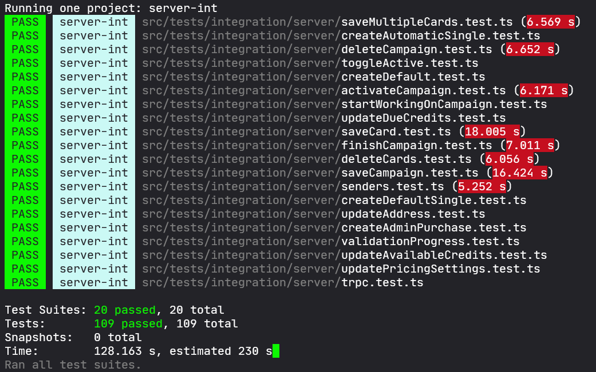
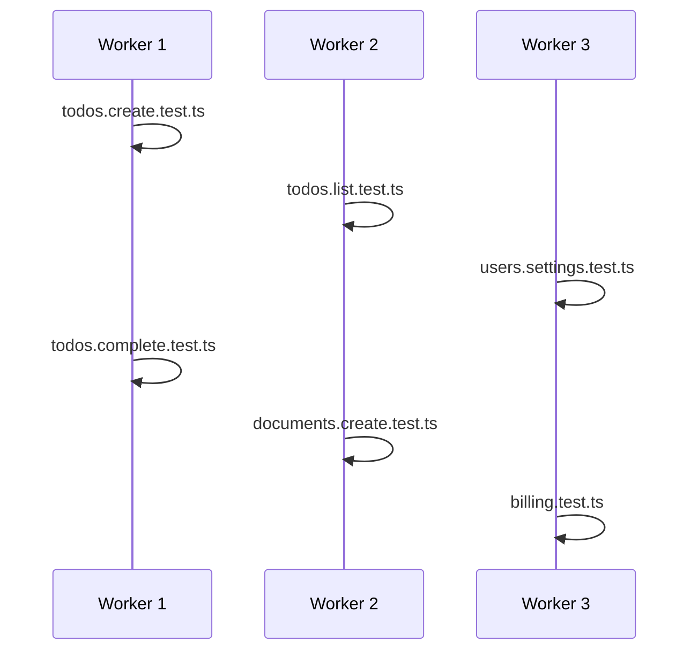
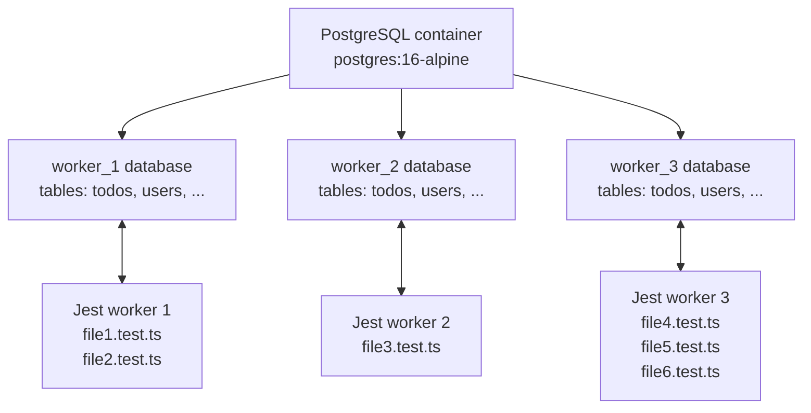
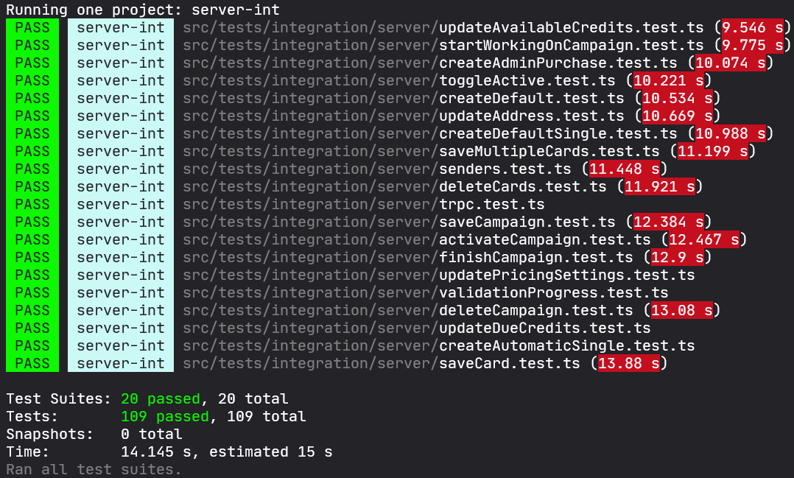
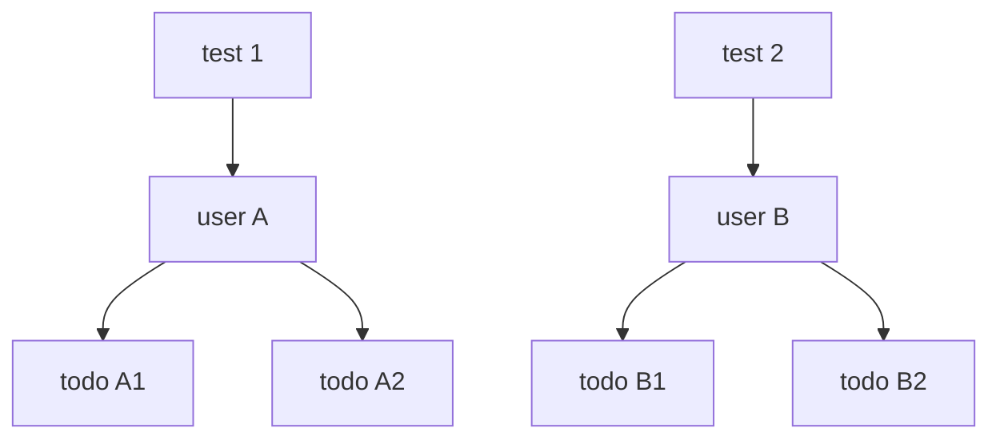
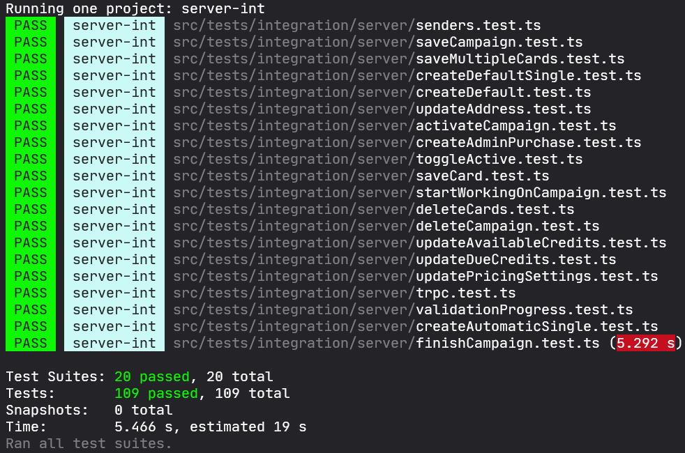

# How We Built Fast Database Integration Tests

## Introduction

### Section Review

- Are the claims about integration tests being slower than unit tests too generic unless we immediately tie them to database setup, IO, and cleanup?
- If we mention external references for test speed, are they actually needed, or do they distract from the Manuscritten story?
- The in-memory database critique must not sound like a universal law. Are we saying "bad for this kind of test" instead of "bad always"?
- Testcontainers must be introduced as a tool that removed our Docker boilerplate, not as a product brochure.
- Does the reader know this article is about backend-to-database integration tests, not browser end-to-end tests?

### Draft

The conventional wisdom about testing tends to repeat the same idea about integration tests: *Integration tests cover more surface than unit tests, but they take much more time both to write and to execute*.

They take longer to write because the test has to bring more of the application with it. A unit test can call a function in memory and be done. A database integration test needs a real database to talk to. So we have to consider how to spawn it: is an in-memory version sufficient, or do we need a real one? And once we have one, we need to run migrations on it, handle connection URLs, env vars, and all of that config. But that's not even the hard part. The harder part is that now, since the DB is persistent, we need to design a way to stop one test from leaking state into the next one. We will deal with complexity throughout the article.

They also take longer to run because every external system adds waiting time. The test has to talk to another process, even if that process is just PostgreSQL inside a local Docker container. It may have to wait for the container to start, for migrations to run, and for the database to be cleaned before the next test begins. All of this adds up to the execution time of the tests. That translates in that while unit tests are expected to run [<10s](https://stackoverflow.com/questions/10486/unit-test-execution-speed-how-many-tests-per-second), it is not strange for integration tests to take minutes, or [even hours](https://medium.com/lets-code-future/our-integration-tests-take-2-hours-heres-why-we-can-t-delete-them-b5fd0fd427dd) to run.

The problem is that if tests take too much time, they lose one of the main advantages of having a test suite: helping you avoid regressions while developing. If tests take that long, you end up writing too much code without running your tests. And that can lead to situations where you thought you had finished a new feature, only to find out that you've broken 20 tests because of one bad refactor you did an hour ago.

Ideally, the optimal thing would be to have unit tests run in a reasonable time, less than 5 minutes (and ideally in less than a minute) so that you can exercise them more.

In this article I am going to share a test architecture I've found to be the most useful for building **fast** integration tests at [Manuscritten](http://manuscritten.com/). As we will see, this way of writing integration tests allowed us to go from taking 2 minutes to run every 100 tests to just 6 seconds.

For space reasons, I'm going to focus on server tests that talk to a database. But the same ideas here can work for more general tests that introduce other services (caches, S3, external services, etc.).

Ok, enough yapping. Let's start with the first thing you need to create an integration test: the external system. In this case the database.

## Spawning a database

### Section Review

### Draft

There are usually two ways people work with external databases.

The first is to use an in-memory database. Basically, instead of using a real external database, you use an in-memory library that exposes part of the same API as the database but, instead of storing data on disk, keeps it in memory. The main advantage of this approach is, again, that you avoid IO and having to talk to an external server. The database runs in the same process; it is just a library call. And while that is useful, this kind of in-memory DB has some drawbacks that make me avoid it.

The most important one is that in-memory DBs have **their own implementation** that cover just **part** of the real DB API, not all of it. Complex features like transactions, constraints, row locks, CTEs, indexes, etc. are generally not supported. And even if they are, who can assure you that they work the same way as the real database? You can find bugs that occur in a flaky in-memory implementation that do not happen in the DB, and vice versa.

The second option we have is to just spawn a real database. Today that usually means Docker.

This approach used to be annoying because it required more config: Docker Compose files, managing ports, exporting environment variables, scripts for cleaning up the container afterward and all of that hassle.

Today we have a great library, Testcontainers, that removes much of that. It is much simpler because we can create the Docker container inside the test setup code itself. There are modules for common infrastructure like PostgreSQL, MySQL, Redis, and Kafka, so in many cases you do not start from raw Docker primitives.

Instead of preparing a database outside the test run, the harness asks for one when it needs it.

```ts
const container = await new PostgreSqlContainer("postgres:16-alpine")
  .withDatabase("manus_test")
  .withUsername("manus")
  .withPassword("manus")
  .start();

const connectionUri = container.getConnectionUri();
```

That connection URI is enough to run migrations and create the real database client used by the application.

How do we use it with jest? From now on, imagine we have a simple todo app that has this file structure:

```text
todo-app/
  package.json
  jest.config.ts
  src/
    db/
      testDatabase.ts
    todos/
      Todo.ts
      createTodo.ts
      todoController.ts
    tests/
      integration/
        todos.test.ts
      utils/
        serverIntGlobalSetup.ts
        serverIntGlobalTeardown.ts
```

In this setup, the production code lives in `src/todos/`. And its respective tests are in `src/tests/integration/`. But now we care about the Jest setup files, that live under `src/tests/utils/`. Except of course the `jest.config.ts` that is in the root of the app, and looks like this: 

```ts
// jest.config.ts
import type { Config } from "jest";

const config: Config = {
  testEnvironment: "node",
  testMatch: ["<rootDir>/src/**/*.test.ts"],
  globalSetup: "<rootDir>/src/tests/utils/serverIntGlobalSetup.ts",
  globalTeardown: "<rootDir>/src/tests/utils/serverIntGlobalTeardown.ts",
  maxWorkers: 1,
};

export default config;
```

For now, notice the `maxWorkers: 1`.

That is intentional. At this point we are creating one shared database for the test run. If Jest ran several files in parallel, two test files could touch the same tables at the same time. One file could truncate the database while another file is still making assertions. We'll discuss this later. For now, just use one worker.

What we really care about now are the `globalSetup` and `globalTeardown`. `globalSetup` runs once before the test suite starts, and `globalTeardown` runs once after the suite finishes. And we will use them to **raise** the DB container and to **stop** it respectively.

The setup file can look like this:

```ts
// src/tests/utils/serverIntGlobalSetup.ts
import { writeFileSync } from "fs";
import { join } from "path";
import { tmpdir } from "os";
import { PostgreSqlContainer } from "@testcontainers/postgresql";
import { runMigrations } from "@/db/testDatabase";

const stateFile = join(tmpdir(), "server-int-postgres.json");

declare global {
  var __SERVER_INT_CONTAINER__: StartedPostgreSqlContainer | undefined;
}

export default async function serverIntGlobalSetup() {
  const container = await new PostgreSqlContainer("postgres:16-alpine")
    .withDatabase("app_test")
    .withUsername("test")
    .withPassword("test")
    .start();

  const databaseUrl = container.getConnectionUri();
  await runMigrations(databaseUrl);

  globalThis.__SERVER_INT_CONTAINER__ = container;
  writeFileSync(stateFile, JSON.stringify({ databaseUrl }), "utf8");
}
```

This file starts the PostgreSQL container, asks Testcontainers for the connection URL. Then it runs the migrations, and writes the URL to a small JSON file in the OS temp directory.

That file is needed because Jest's global setup does not run in the same execution context as the test files. So the only way to share the db url with the tests is to through a temp JSON file. Each test file will use a function like this in the `beforeAll` to extract the content of that file:

```ts
function readTestDatabaseState() {
  const raw = readFileSync("server-int-postgres.json", "utf8");
  return JSON.parse(raw) as {
    connectionUri: string;
    templateDatabaseName: string;
  };
}
```

The teardown file stops the container and removes the state file:

```ts
// src/tests/utils/serverIntGlobalTeardown.ts
import { rmSync } from "fs";
import { join } from "path";
import { tmpdir } from "os";

const stateFile = join(tmpdir(), "server-int-postgres.json");

export default async function serverIntGlobalTeardown() {
  await globalThis.__SERVER_INT_CONTAINER__?.stop();
  rmSync(stateFile, { force: true });
}
```

The tests can then read the state file and create the database client from the URL. The important part is that the database has already been started and migrated before any test runs.

The package script can also stay simple:

```json
{
  "scripts": {
    "test": "jest"
  }
}
```

Now let's see how a test can use that database.

## The Anatomy Of A Test

### Section Review

- The example must stay simple enough to read, but concrete enough to show why a real database matters.
- Are we showing cleanup before explaining the cleanup problem? That is fine only if the section later names why it exists.
- Does the code use a familiar example instead of forcing readers to understand product-specific entities too early?
- Are mocks omitted deliberately? If yes, the prose should say external API mocks exist in the real suite but are not relevant here.
- Does the test assert persisted state, or only API response shape?

### Draft

To see how a test would look using this setup, let's keep the example of the todo app. The main use case would be: A user can create a todo.

So we have a very simple `Todo` class:

```typescript
export class Todo {
  private id: string;
  private userId: string;
  private title: string;
  private completed: boolean;

  constructor(userId: string, title: string) {
    this.id = crypto.randomUUID();
    this.userId = userId;
    this.title = title;
    this.completed = false;
  }

  complete() {
    this.completed = true;
  }
}
```

And its respective tables:

```sql
CREATE TABLE users (
  id uuid PRIMARY KEY,
  name text NOT NULL
);

CREATE TABLE todos (
  id uuid PRIMARY KEY,
  user_id uuid NOT NULL REFERENCES users(id),
  title text NOT NULL,
  completed boolean NOT NULL DEFAULT false
);
```

Note: That `user` relationship is will allow an important optimization technique, as we will see later.

Let's say we also have an endpoint for creating new todos. It receives a title, inserts a row for the authenticated user, and returns the id of the created todo.

So a controller like this:

```ts
app.post("/todos", async (req, res) => {
  const result = await createTodo(
    { title: req.body.title },
    req.context,
  );

  res.json(result);
});
```

The controller will then call an application service that does the actual work:

```ts
async function createTodo(
  { title }: { title: string },
  context: { db: Db; user: User },
) {
  const [todo] = await context.db`
    INSERT INTO todos (id, user_id, title)
    VALUES (${crypto.randomUUID()}, ${context.user.id}, ${title})
    RETURNING id
  `;

  return { todoId: todo.id };
}
```

We can create a simple integration test for that input that looks like this:

```ts
let db: Db;
let app: Express;
let user: { id: string; name: string };

beforeAll(async () => {
  // First we extract the database url from the json file
  // the global setup wrote. See previous section.
  const { databaseUrl } = readTestDatabaseState();

  //We then initialize the ORM for that url.
  db = createDb(databaseUrl);

  //We set up the user that will be owner of the todos for the different
  //tests.
  user = new User({ id: crypto.randomUUID(), name: "Javi" });
  
  // And we initialize the server. We pass the user as a way to indicate that
  // it will be automatically authenticated for all petitions. The way you can
  // do that will depend on you particular framework and setup.
  app = createExpressTestApp({
    db,
    user,
  });
});

beforeEach(async () => {
  //We clean the db completely between tests to avoid
  //previous rows to break the test
  await resetDatabase(db);
  await db`
    INSERT INTO users (id, name)
    VALUES (${user.id}, ${user.name})
  `;
});

it("creates a todo", async () => {
  const response = await request(app)
    .post("/todos")
    .send({ title: "Send invoices" })
    .expect(200);

  const [savedTodo] = await db`
    SELECT title, user_id
    FROM todos
    WHERE id = ${response.body.todoId}
  `;

  expect(savedTodo.title).toBe("Send invoices");
  expect(savedTodo.user_id).toBe(user.id);
});
```

`beforeAll` reads the database URL written by `globalSetup` and creates a database client for this file. Then it creates the user for this test file and builds the Express app with that database and user.

`beforeEach` resets the database so every test starts from empty state. The reset can be implemented with a truncate:

```ts
async function resetDatabase(db: Db) {
  await db`
    TRUNCATE TABLE todos, users
    RESTART IDENTITY CASCADE
  `;
}
```

Then the test calls the API and inspects the database.

The important part is that the assertion goes directly to PostgreSQL. We are checking whether the endpoint left the database in the expected state.

### Why The Reset Is There

I want to dive a little bit more on the reset. The reset also makes sense at this stage. Without it, tests can fail because of data left by previous tests.

Imagine this pair:

```ts
it("creates a todo", async () => {
  await request(app)
    .post("/todos")
    .send({ title: "Send invoices" })
    .expect(200);

  const [savedTodo] = await db`
    SELECT title, user_id
    FROM todos
    WHERE id = ${response.body.todoId}
  `;

  expect(savedTodo.title).toBe("Send invoices");
  expect(savedTodo.user_id).toBe(user.id);
});

it("lists active todos", async () => {
  //Setup. We create a todo for the list endpoint to return.
  await request(app)
    .post("/todos")
    .send({ title: "Buy stamps" })
    .expect(200);

  // No we are trying the endpoint that returns
  // the todos from a user
  const todos = await request(app)
    .get("/todos") 
    .send({ title: "Buy stamps" })
    .expect(200);

  expect(todos).toHaveLength(1);
});
```

If the database is not truncated between tests, the second test can receive two active todos instead of one: the todo it created and the todo left behind by the previous test. The endpoint can be perfectly correct and the test can still fail because the test environment is dirty.

Perfect, now we have a way to setup a database and run integration tests on it. But is it fast?

## What If You Want To Run One Hundred Tests Instead Of One?

### Section Review

- Does the section show the cost of running many tests before introducing parallelism?
- Is the runtime framed as acceptable for integration tests but bad for development feedback?
- Does the section explain why the number grows with test count?
- Does the transition point clearly at `maxWorkers: 1` as the first obvious bottleneck?
- Does the reader understand why "just increase workers" is not safe yet?

### Draft

So, how much does this take if we run, say, one hundred tests?

Let's check it out.



So 2 minutes to run. That number is not shocking for an integration test suite that talks to a db, but it is still well above the kind of feedback loop I expect from a unit test suite. Unit tests are usually expected to run in something closer to seconds, often under [10 seconds](https://stackoverflow.com/questions/10486/unit-test-execution-speed-how-many-tests-per-second). Four minutes is a different animal during development.

And the worst part is that this number grows with the number of tests.

If one hundred tests take around four minutes, one thousand tests could take something in the region of forty minutes with the same shape. One thousand tests is not a crazy number in a large codebase. But forty minutes is impossible to use as a development feedback loop.

So how do we improve this?

If you remember the Jest config from the previous section, we deliberately set `maxWorkers` to `1`:

```ts
// jest.config.ts
const config = {
  testEnvironment: "node",
  globalSetup: "<rootDir>/src/tests/utils/serverIntGlobalSetup.ts",
  globalTeardown: "<rootDir>/src/tests/utils/serverIntGlobalTeardown.ts",
  maxWorkers: 1,
};
```

That means there is no parallelism. Jest runs the tests serially, one after another.

The most obvious way to make the suite faster is to increase the number of workers. Let Jest run several tests at the same time.

But if we do that while all tests share the same database, we can introduce race conditions in the test harness itself.

To see why, we need to look at how Jest parallelizes tests.

## How Jest Parallelizes Tests?

### Section Review

- Does the section explain what a Jest worker is before using it in diagrams?
- Does the race condition use two complete tests rather than abstract fragments?
- Is the interleaving concrete enough to make the failure obvious?
- Does the solution follow from the problem: one worker plus one database works, many workers plus one database does not?
- Does the code show both the worker database creation and the template database optimization?

### Draft

Jest usually parallelizes at the file level.

A worker is a separate process created by Jest to run test files. If Jest has one worker, it runs one file at a time. If Jest has eight workers, it can run up to eight test files at the same time.

Inside a single file, tests run sequentially by default. The worker executes the file from top to bottom: `beforeAll`, then the tests, then `afterAll`. [This article](https://cmdcolin.github.io/posts/2021-10-05-jest/) explains it well.

Across files, though, workers can run in parallel.



That is good for speed, but dangerous if every worker shares the same database.

Imagine we have these two test files.

The first one checks that we can create a todo:

```ts
// src/tests/integration/todos.create.test.ts
beforeEach(async () => {
  await resetDatabase(db);
  await insertUser(db, user);
});

it("creates a todo", async () => {
  const response = await request(app)
    .post("/todos")
    .send({ title: "Send invoices" })
    .expect(200);

  const [todo] = await db`
    SELECT title
    FROM todos
    WHERE id = ${response.body.todoId}
  `;

  expect(todo.title).toBe("Send invoices");
});
```

The second one checks that listing active todos returns only the todos it created:

```ts
// src/tests/integration/todos.list.test.ts
beforeEach(async () => {
  await resetDatabase(db);
  await insertUser(db, user);
});

it("lists active todos", async () => {
  await request(app)
    .post("/todos")
    .send({ title: "Buy stamps" })
    .expect(200);

  const todos = await request(app)
    .get("/todos/active")
    .send()
    .expect(200);

  expect(todos).toHaveLength(1);
});
```

If those files run one after another, everything is fine.

But with multiple workers, the execution can interleave like this:

```text
Initial state:
database is empty

Worker 1, todos.create.test.ts:
1. beforeEach truncates todos and users
2. beforeEach inserts user
3. test calls POST /todos with "Send invoices"
4. database now has one todo

Worker 2, todos.list.test.ts:
5. beforeEach truncates todos and users
6. beforeEach inserts user

Worker 1:
7. test tries to read the todo it created
8. the todo is gone

Worker 1 result:
the endpoint worked, but the test fails
```

So basically we can have race conditions in our tests. The problem is that Worker 2 cleaned the shared database while Worker 1 was still using it.

So, how do we deal with this? Well, If I have one worker and one database, everything works fine. The problem appears when we introduce multiple workers into a single database. So why not create a separate database for each worker and make each worker run in isolation?

That turned out to be a great idea. Let's see how its implemented.

First, important to note, when I say one database per worker, I do not mean one Docker container per worker. I mean one PostgreSQL container with several databases inside it.



Every worker has its own database with its own tables. Worker 1 can truncate `worker_1.todos` as much as it wants. Worker 2 is using `worker_2.todos`, so it will not notice.

The implementation has two parts.

First, global setup starts the single PostgreSQL container and prepares a migrated template database:

```ts
// src/tests/utils/serverIntGlobalSetup.ts
function replaceDatabaseName(connectionUri: string, databaseName: string) {
  const url = new URL(connectionUri);
  url.pathname = `/${databaseName}`;
  return url.toString();
}

export default async function serverIntGlobalSetup() {
  const container = await new PostgreSqlContainer("postgres:16-alpine")
    .withDatabase("app_test")
    .withUsername("test")
    .withPassword("test")
    .start();

  const connectionUri = container.getConnectionUri();
  const templateUrl = replaceDatabaseName(
    connectionUri,
    "app_test_template",
  );

  const conn = postgres(connectionUri);
  await conn.unsafe(`CREATE DATABASE "app_test_template"`);
  await conn.end();

  await runMigrations(templateUrl);

  writeFileSync(stateFile, JSON.stringify({
    connectionUri,
    templateDatabaseName: "app_test_template",
  }));

  globalThis.__SERVER_INT_CONTAINER__ = container;
}
```

The template database is the database that pays the migration cost. Instead of running migrations once per worker, we run migrations once and then copy that migrated database.

Then, for creating each of the worker databases we need a way to identify in which worker we are running. For that, Jest gives us `JEST_WORKER_ID`, so the database name can be deterministic:

```ts
// src/tests/utils/workerDatabase.ts
function getWorkerDatabaseName() {
  const workerId = process.env.JEST_WORKER_ID ?? "main";
  return `app_test_worker_${workerId}`;
}
```

Each test file can call a helper in `beforeAll` that creates or reuses the database for the current worker:

```ts
// src/tests/integration/todos.create.test.ts
beforeAll(async () => {
  const { connectionUri, templateDatabaseName } = readTestDatabaseState();
  const databaseName = getWorkerDatabaseName();

  await createWorkerDatabase(
    connectionUri,
    databaseName,
    templateDatabaseName,
  );

  db = createDb(replaceDatabaseName(connectionUri, databaseName));
  app = createExpressApp({ db, user });
});
```

The database creation helper copies from the template:

```ts
// src/tests/utils/workerDatabase.ts
async function createWorkerDatabase(
  adminUrl: string,
  databaseName: string,
  templateName: string,
) {
  const conn = postgres(adminUrl);

  const exists = await conn`
    SELECT 1
    FROM pg_database
    WHERE datname = ${databaseName}
  `;

  if (exists.length === 0) {
    await conn.unsafe(`
      CREATE DATABASE "${databaseName}"
      TEMPLATE "${templateName}"
    `);
  }

  await conn.end();
}
```
And with that we have all to isolate the test execution of the workers in its own database. Now we can increase the Jest workers confidently:

```ts
// jest.config.ts
const config = {
  testEnvironment: "node",
  globalSetup: "<rootDir>/src/tests/utils/serverIntGlobalSetup.ts",
  globalTeardown: "<rootDir>/src/tests/utils/serverIntGlobalTeardown.ts",
  maxWorkers: 8,
};
```

And if we check it out, we can see that the result is much much better:



The same suite that was taking around two minutes went down to roughly fourteen seconds! Almost a 10x improvement. That's impresive and we can leve it there but...

## Can We Improve This Even More?

### Section Review

- This section should start from the remaining pain: truncation. Does it avoid jumping straight to the solution?
- The stale-data example needs to be concrete and small.
- Are we clear that worker databases prevent cross-worker conflicts, but not stale data inside the same worker?
- The domain-boundary trick must be explained before applying it to the todo example.
- Are we being too confident? This strategy depends on user scoping and does not apply to every table.

### Draft

Going from around  2mins to 14 s was significant.

But there was still one thing that bothered me: cleanup.

Every test did this:

```ts
beforeEach(async () => {
  await resetDatabase(db);
});
```

Which basically cleans up the table rows and leaves them empty:

```sql
TRUNCATE TABLE todos, users
RESTART IDENTITY CASCADE;
```

Ideally we would like to remove this truncate but, as we shaw in the *Why The Reset Is There* section. Deleting the resets could lead to tests failing because of dirty data that previous tests (that ran in the same worker, of course) left there.

So if we want to remove the truncate, every test needs a way to avoid touching the data from other tests. We need to isolate the storage for each test.

Most applications already have a natural boundary for this. I am talking about, of course, about the user.

If you remember how we defined the `Todo` class in *The Anatomy Of A Test*, every todo belonged to a user. This is the typical thing that happens in web applications. Most objects belong to the owner of the account.

So, for example, when a user opens their todos page, the backend should not return every todo in the database. It should return that user's todos.

```sql
select *
from todos
where user_id = $current_user_id
  and completed = false;
```

That is, of course, reasonable. You should not be able to see what todos another person has created. You should only see your own.

We can take advantage of this natural ditribution to isolate tests from each other if we make each test work with its own fresh user and authenticate as that user.



The old setup used fixed module-level fixtures and global cleanup:

```ts
const user = new User({ id: crypto.randomUUID(), name: "Javi" });

beforeEach(async () => {
  await resetDatabase(db);
  await insertUser(db, user);

  app = createExpressApp({ db, user });
});
```

The new setup regenerates fixtures before each test:

```ts
let user: User;

function resetFixtures() {
  user = new User({ id: crypto.randomUUID(), name: "Javi" });
}

beforeEach(async () => {
  resetFixtures();
  await insertUser(db, user);

  app = createExpressApp({ db, user });
});
```

Now each test gets a fresh user id. Rows from previous tests remain in the database, but user-scoped endpoints do not see them.

This is the key condition:

```sql
select *
from todos
where user_id = $authenticated_user_id;
```

If the endpoint has that filter, stale todos from other users are irrelevant.

This does not replace cleanup everywhere. It is a technique for tests whose data is naturally scoped. Global admin views, unique constraints that are not user-scoped, analytics queries, job tables, and other cross-user behavior still need care and some kind of hard clean up between tests.

But in many applications, user scoping covers a lot of tests.

This was the case of our tests. Most of them where company scope (we work mainly with B2B). So we could make each test create its own company and avoid cleaning up the database alltogether. After removing the unnecessary truncates and regenerating user-scoped fixtures, the suite went down to around 6 seconds.



So, another 2x improvement from the previous version. And a 20x from the initial one.

## Next Steps

### Section Review

- Does this section explain the reverted experiments as measured decisions, not random trivia?
- Are we careful not to claim the current setup is the theoretical best possible setup?
- Do the future ideas sound plausible without becoming a todo list for the reader?
- The closing should not become moralizing. Keep it tied to this setup and this suite.
- Does the final paragraph invite feedback without sounding like engagement bait?

### Draft

That is basically the setup we use now.

One PostgreSQL container per server integration run + a database per Jest worker + fresh fixtures for every tests (where that is safe).

There are probably more things you can do to reduce the execution time even more. In fact, I've have tried a bunch of them. But I haven't found any other improvement that can reduce the time a significant amount (another second for example).

One idea that I though coul have some impact was to keep the database container alive between test runs. Testcontainers supports reusable containers, so I tried to reuse the container and only rebuilt the template database when migrations changed.But the runtime almost didn't move. So I reverted it.

There are still optimizations I have not tried that I think could improve efficency. Especially two: 
1. Pre-transpiling TypeScript before the test run might help, because jest takes some time (a couple seconds) from the point it identifies the tests to the point it starts running them. And I suspect it is due to typescript compilation.
2. And the other one is removing durability settings do not matter in a throwaway database. Like WAL or even persisting on disk.

But, for now, the current setup is enough for us. Our current setup, that contains around 300 integration tests runs in about 10 seconds. Which is more than enough to run them regularly.

So yeah, that's basically it. If you have any other technique for reducing the execution time even more, tell me, I want to know. 

See you around.