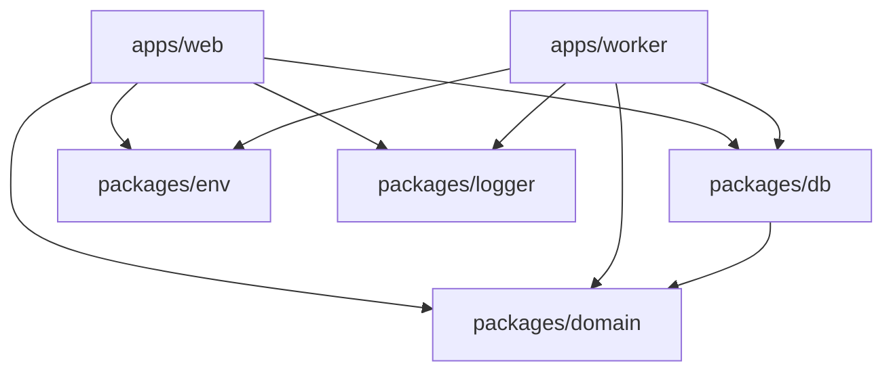

# Building A Long-Running Job Worker

## Series Summary

This series explains how Manuscritten moved one expensive workflow out of a Next.js request and into a dedicated worker.

The trigger was CSV campaign import. Small campaigns worked fine when address validation happened close to the request/response path, but larger campaigns with hundreds or thousands of recipients made the old model break down. Google Address Validation is called once per address, so the feature stopped looking like a normal backend mutation and started looking like a long-running job.

The series follows the migration in three steps:

1. Understanding why the original Next.js/Vercel execution model stopped fitting the feature.
2. Reshaping the codebase into a monorepo so the worker could reuse the same domain, database, environment, and logging code as the web app.
3. Building the actual worker with Graphile Worker and Postgres.

The custom `job` table is intentionally out of scope for this series. It existed historically, but these posts should explain the current Graphile Worker path.

## Post 1: When A Next.js Request Stopped Being Enough

### Purpose

Explain the product problem and the execution-model mismatch before introducing any tooling. The reader should finish this post understanding why a separate worker became necessary.

### Sections

#### 1. The Setup That Worked

- Open with the initial Manuscritten architecture: one Next.js app containing the frontend and backend.
- Explain why that was a good starting point: simple deployment, fast iteration, colocated product and API code.
- Mention that most requests were normal database operations: create campaigns, save designs, update cards, read campaign state.
- Make the point that this architecture was not "wrong"; it fit the app while the work was short-lived.

#### 2. The CSV Feature That Changed The Shape Of The Problem

- Introduce one-off campaigns created from CSV uploads.
- Explain the product workflow: customers upload recipient data, Manuscritten turns those rows into handwritten-letter cards.
- Explain why address quality matters: bad addresses affect deliverability and operational cost.
- Introduce Google Address Validation as the mechanism used to normalize and validate recipient addresses.
- Make the important detail explicit: the implementation validates each address individually.

#### 3. Why 100 Recipients Felt Fine And 2000 Did Not

- Use the concrete scale shift: 100-200 rows behaved reasonably, then customers wanted 600, 1000, or 2000 letters.
- Show the multiplication: 2000 recipients means roughly 2000 external validation calls.
- Explain why this is different from a slow SQL query: it is a long sequence of network-bound work.
- Mention that even if each individual call is acceptable, the whole workflow can run for minutes.

#### 4. The Request/Response Boundary Was The Wrong Place

- Explain the shape of a normal HTTP request: the user asks for something, the server does the work, the server responds.
- Contrast that with the CSV validation workflow: the server accepts work that will continue after the user should already have an answer.
- Explain the Vercel/serverless constraint carefully:
  - serverless functions are optimized for short requests;
  - long-running work is more fragile there;
  - exact limits should be verified against current Vercel docs before final prose.
- Avoid making the section only about Vercel limits. The deeper issue is that the work had the wrong lifecycle.

#### 5. The New Contract

- Introduce the desired backend contract:
  - receive and validate the uploaded CSV shape;
  - create the cards;
  - mark the campaign as validating;
  - enqueue a background job;
  - return a response quickly.
- Explain the desired user contract:
  - the upload was accepted;
  - validation is now running;
  - the UI can show progress;
  - the user does not need to keep an HTTP request alive.
- End with the conclusion: the app needed a separate process that could keep working after the request ended.

#### 6. What The Next Post Needs To Solve

- Transition from "we need a worker" to "we need a worker that can reuse our existing system."
- Explain the risk of creating an isolated service that duplicates domain logic.
- Set up the monorepo as the next step: not a cosmetic refactor, but a way to share the real application core.

## Post 2: Turning One App Into A Monorepo

### Purpose

Explain why the worker required a codebase split before it required queue code. The reader should finish this post understanding the package boundaries and why each shared package exists.

### Sections

#### 1. The Worker Could Not Be A Copy Of The Backend

- Start from the tempting but bad version: create a separate worker app and paste whatever code it needs.
- Explain why that breaks down:
  - validation needs `Card` behavior;
  - credit assignment needs campaign/company rules;
  - persistence needs repositories and schema;
  - logs and environment variables need to look the same as the web app.
- State the main idea: the worker should be a second runtime over the same application core, not a second implementation of the product.

#### 2. The New Shape Of The Repository

- Introduce the monorepo layout:
  - `apps/web`;
  - `apps/worker`;
  - `packages/db`;
  - `packages/domain`;
  - `packages/env`;
  - `packages/logger`.
- Explain that the root `package.json` uses npm workspaces with `apps/*` and `packages/*`.
- Mention the separate scripts for running/building web and worker.
- Keep the focus on the dependency shape, not on workspace tooling trivia.

#### 3. Extracting The Domain Package

- Explain what belongs in `packages/domain`:
  - `Campaign`;
  - `Card`;
  - address validation functions;
  - shared job payload model;
  - business decisions such as card validation and credit calculation.
- Show the principle: domain code should not know whether it is being called from a tRPC endpoint or from a worker task.
- Use a small example import from the worker, such as `validateCardAddressWithGoogle`.

#### 4. Extracting The Database Package

- Explain what belongs in `packages/db`:
  - Drizzle schema;
  - connection setup;
  - migrations;
  - repositories;
  - the Graphile enqueue adapter.
- Explain why the worker should use the same repositories as the web app.
- Mention that the worker uses the same Postgres database, and Graphile Worker adds its own schema/tables there.
- Avoid discussing the old custom `job` table.

#### 5. Extracting Environment And Logging

- Explain why `packages/env` matters:
  - `DATABASE_URL`;
  - `GOOGLE_MAPS_API_KEY`;
  - `SKIP_ADDRESS_VALIDATION`;
  - worker-specific settings in `apps/worker/src/env.ts`.
- Explain why `packages/logger` matters:
  - job logs need the same identifiers as request logs;
  - provider failures need to be captured outside the web request;
  - worker execution needs observability.
- Keep this section practical: when background work fails, the browser is no longer the place where you see the failure.

#### 6. The Dependency Direction

- Draw or describe the dependency flow:
  - `apps/web` depends on shared packages;
  - `apps/worker` depends on shared packages;
  - shared packages do not depend on either app.
- Include a Mermaid diagram in the later draft:



- Explain that this is what makes the worker feel like part of the same system.

#### 7. What The Next Post Can Now Do

- Close by showing that the codebase now has the pieces needed for a real worker:
  - an independent runtime;
  - shared domain logic;
  - shared persistence;
  - shared configuration;
  - shared observability.
- Transition to Graphile Worker: now the system needs a way to enqueue and execute jobs.

## Post 3: Building The Worker With Graphile Worker And Postgres

### Purpose

Explain the current worker implementation in concrete terms. The reader should finish this post understanding how the web app enqueues validation work, how Graphile Worker picks it up, and how the UI observes progress.

### Sections

#### 1. Why Postgres Was Enough For The Queue

- Start from the practical constraint: Manuscritten already had Postgres.
- Explain why this made Graphile Worker attractive:
  - no extra queue infrastructure for the first version;
  - jobs live close to the transactional data;
  - the worker can run as a separate process;
  - Graphile Worker handles polling, locking, retries, and task dispatch.
- Keep this grounded. Do not claim Postgres is always the right queue. It was a good fit for this scale and architecture.

#### 2. Enqueuing The Validation Job From The Web App

- Walk through `saveMultipleCards`.
- Explain the sequence:
  - parse/build cards from uploaded rows;
  - add campaign variables;
  - call `campaign.startCardsValidation()`;
  - save cards and campaign state in a transaction;
  - create a `Job` with type `validate_cards`;
  - enqueue it with `GraphileJobEnqueuer`.
- Show a simplified pseudocode snippet:

```ts
await db.transaction(async (tx) => {
  await cardRepo.saveMultiple(cards, variables);
  campaign.startCardsValidation();
  await campaignRepo.saveWithoutCredits(campaign);

  await new GraphileJobEnqueuer(tx).enqueue(
    Job.new({
      type: JobType.VALIDATE_CARDS,
      companyId: campaign.companyId,
      campaignId: campaign.id,
      total: cards.length,
    }),
  );
});
```

- Emphasize that the request returns after enqueueing; it does not validate every address inline.

#### 3. The Graphile Enqueue Adapter

- Explain `GraphileJobEnqueuer`.
- Show that it calls `graphile_worker.add_job`.
- Explain what gets passed:
  - task identifier: `validate_cards`;
  - payload: serialized job data;
  - job key: stable identifier for lookup/testing/observability.
- Explain why wrapping Graphile behind `JobEnqueuer` keeps Graphile out of most application code.

#### 4. Starting The Worker Process

- Walk through `apps/worker/src/index.ts`.
- Explain startup:
  - start OpenTelemetry;
  - start pending job metrics sampler;
  - setup graceful shutdown;
  - start Graphile Worker.
- Walk through `apps/worker/src/graphile.ts`:
  - run Drizzle migrations;
  - run Graphile Worker migrations;
  - configure connection string, concurrency, poll interval;
  - register tasks.
- Mention `WORKER_CONCURRENCY`, `WORKER_CHUNK_SIZE`, and `WORKER_POLL_INTERVAL_MS`.

#### 5. Mapping Job Types To Tasks

- Explain the task map in `apps/worker/src/tasks/index.ts`.
- List current task types:
  - `validate_cards`;
  - `post_sent`;
  - `card_created_side_effects`;
  - `daily_pending_report`.
- Focus only on `validate_cards` for the main article path.
- Explain that each task is wrapped in `observeJobRun`, so job execution has logging/tracing around it.

#### 6. Processing Cards In Chunks

- Walk through `validateCardsTask`.
- Explain the task setup:
  - reconstruct domain job from Graphile payload;
  - load campaign/card/design/company repositories;
  - exit cleanly if required entities are missing.
- Explain the loop:
  - fetch cards to validate with `getCardsToValidate`;
  - use `WORKER_CHUNK_SIZE`;
  - validate each address with Google;
  - mark the card as validated;
  - recalculate price/credits;
  - save card and campaign updates in a transaction.
- Explain `withLockRetry` briefly: validation updates campaign credits, so lock conflicts can happen and should be retried.

#### 7. Calling Google Address Validation

- Explain the domain function `validateCardAddressWithGoogle`.
- Show what data is sent:
  - address;
  - zip;
  - city;
  - province.
- Explain what comes back:
  - normalized address components;
  - whether the address should be accepted;
  - possible definitive validation error.
- Mention `SKIP_ADDRESS_VALIDATION` for tests/performance scenarios.
- Keep the Google section focused on why the work is slow and external, not on every field of the API response.

#### 8. Finishing Validation And Updating Progress

- Explain that each card has a `validated` flag.
- Explain that the campaign has `validatingCards`.
- At the end of the task:
  - count remaining unvalidated cards;
  - if zero, call `campaign.finishValidation()`;
  - save the campaign state.
- Explain the progress query:
  - total cards;
  - validated cards;
  - pending cards;
  - percentage.
- Explain the UI behavior:
  - poll every 2 seconds while validating;
  - show "X of Y cards validated";
  - refetch cards/campaign/company when validation finishes.

#### 9. Observability Once Work Leaves The Request

- Explain why logging changes when the work runs outside the request.
- Mention `jobKey`, request/session trace context, and `worker.job.completed` events.
- Explain provider failures:
  - Google Address Validation failures;
  - database failures through repository monitoring.
- Keep this as the closing layer, not a full observability tutorial.

#### 10. What This Architecture Bought Us

- Close the series by restating the new shape:
  - the web request accepts and persists work;
  - Postgres stores the queued job;
  - the worker processes the slow external calls;
  - the UI shows progress;
  - shared packages keep behavior consistent.
- Name the tradeoff:
  - more moving parts;
  - more deployment/configuration;
  - but a much better lifecycle for long-running work.
- End with the core lesson: long-running work is not just slow code. It is a different kind of workflow.
